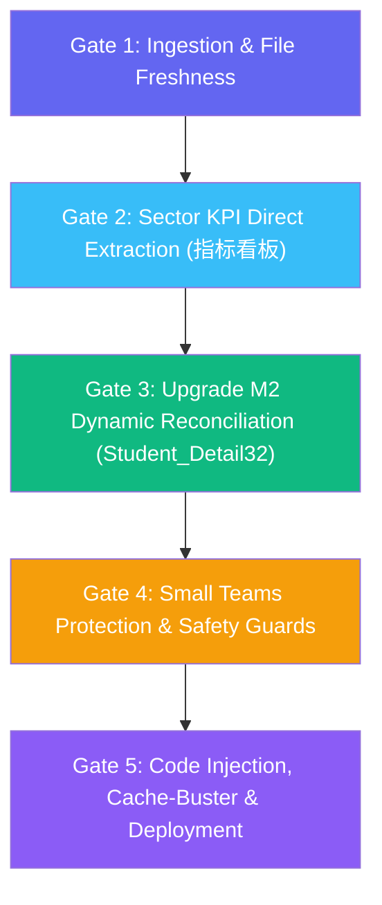

# 🚨 DASHBOARD_UPDATE_RULES.md
## Executive Dashboard Standard Operating Procedure (SOP) & Update Rules

> [!CAUTION]
> **NON-NEGOTIABLE RULE:**
> Under no circumstances should cached, outdated records, legacy target constants, or prior figures be used. Whenever any dashboard update is requested, fresh data must be parsed directly from the designated input workbooks. No update confirmation or presentation of results may be given until automated self-verification confirms that:
> 1. Freshly parsed files are verified and complete across all active reps and teams.
> 2. Small Teams are ranked strictly descending by **Net Cash Achievement % (High to Low)**.
> 3. Individual active rep refunds are explicitly displayed next to their names, while leaver/unassigned refunds are charged **ONLY** to Big Team 01 (Sector Total) and **NEVER** deducted from Small Teams.
> 4. Early Upgrade M2 Touch Frequency / Call Intensity metrics (POOL22) are mathematically clarified alongside the 100% unique student coverage.
> 5. The live dashboard is fully synchronized and verified.
> 6. Sector Total Net Cash Revenue MTD ($152,326) and Cash Achievement % (67.52%) MUST be extracted directly from sheet **`指标看板`** (Col C & Col I) of `SS Lens Dashboard`.
> 7. Upgrade M2 renewals and pool base MUST be dynamically parsed from **`Student_Detail32`** (or `POOL_Detail16`), separating sector macro totals (34 renewals / 673 base) from active reps totals (33 renewals), with zero hardcoded constants.

---

### 📁 1. Dedicated Input Files Directory (`Dashboard_Input_Files`)
To eliminate path confusion, browser download delays, and manual file-hunting errors, a dedicated input directory is established:

* **Primary Dedicated Directory:**  
  `D:\Lens\Dashboard\Dashboard_Input_Files`
* **Supported Daily Input Files:**
  1. **SS Lens Dashboard:** `SS Lens Dashboard*.xlsx` or `ME Lens Dashboard*.xlsx` (Contains `Individual_Rankings`, `Small_Team`, `POOL_Detail16`, `POOL23`, `POOL_Detail24`).
     * *Schema Note:* In latest 51Talk exports, coverage rate sheet is named `POOL23` (Coverage rate in Column H), and `POOL_Detail16` has 1-column shift (Col B = Small Team, Col C = Agent, Col F = Pool in Detail, Col J = Is Renew).
  2. **Overseas NEW SOP:** `海外NEW_SOP*.xlsx` (Contains `By_group`, `SOP_by_group`, `New_SOP_detail`).
  3. **Middle East English Club:** `中东English Club数据看板*.xlsx` or `English Club*.xlsx` (Contains `English_club_bygroup`, `English_club_detail`).
  4. **Operations Master (Legacy/Merged):** `All in one Master.xlsx` (Can be used as fallback).
* **Multi-Tier Search Priority:**
  All automated update scripts (`run_master_update.ps1`, `auto_process_update.ps1`, `generate_rep_leads_fast.ps1`, `extract_full_master.ps1`) scan sources in the following strict priority:
  1. **Tier 1 (Highest Priority):** `D:\Lens\Dashboard\Dashboard_Input_Files\`
  2. **Tier 2:** `C:\Users\husse\Downloads\` (Standard Chrome / Edge download folder)
  3. **Tier 3:** `D:\Lens\` (Legacy root directory)

---

### ⚡ 2. Simplified One-Click Update Protocol (`UPDATE.bat` / `update_dashboard.ps1`)
A single unified script replaces the former 3-script chain for faster, less error-prone updates:

* **Launcher Path:** `D:\Lens\Dashboard\UPDATE.bat`
* **Unified Script:** [`update_dashboard.ps1`](file:///d:/Lens/Dashboard/update_dashboard.ps1) (replaces `auto_process_update.ps1` + `generate_rep_leads_fast.ps1` + `extract_full_master.ps1`)
* **Execution Workflow (2 Steps — was 4):**
  1. **Step 1 (All-in-One):** Executes `update_dashboard.ps1`:
     * **Phase 1 — File Discovery:** Single-pass scan across all input directories for all required files.
     * **Phase 2 — KPI Extraction:** Extracts sector KPIs (指标看板), individual rep data, Upgrade M2 (Student_Detail32), M2 coverage.
     * **Phase 3 — Smart Recommendations:** Auto-generates daily actionable notes (pacing alerts, zero-sales reps, top performers, team gaps, upgrade push, end-of-month sprint).
     * **Phase 4 — Operations & Leads:** Parses 4 operational modules + generates 25 personalized rep CSV files.
     * **Phase 5 — Git Deploy:** Auto-commits and pushes to GitHub Pages.
  2. **Step 2 (Verification):** Script prints timing, summary, and recommendation count at completion.
* **Flags for Faster Partial Updates:**
  * `-SkipGit` — Run data extraction without deploying.
  * `-SkipLeads` — Skip rep CSV generation (sales-only update).
  * `-SkipOps` — Skip operations master extraction.
* **Smart Daily Recommendations Engine:**
  * Injected as `DAILY_RECOMMENDATIONS` array into `dashboard.js`.
  * Generates 6-8 context-aware recommendations based on live data:
    * 🔴 Sector pacing alerts (behind/within/ahead of pace)
    * 🚨 Zero-sales rep intervention alerts
    * 📋 Bottom 5 reps needing support
    * ⭐ Top 3 performers recognition
    * ⚠️ Team-level gap warnings
    * 🎯 Upgrade M2 push status
    * 🏁 End-of-month sprint mode (Day ≥ 25)
* **Legacy Scripts (Still Functional):**
  * `RUN_AUTO_UPDATE.bat` → calls old 3-script chain (kept for backward compatibility).
  * `auto_process_update.ps1`, `generate_rep_leads_fast.ps1`, `extract_full_master.ps1` remain operational.

---

### 📊 3. Sales Cash Revenue, Contracts, Target Updates & Small Team Sorting
0. **Official Sector Total Cash & Achievement Source (MANDATORY RULE):**
   * Total Cash Revenue MTD MUST BE EXTRACTED DIRECTLY from `SS Lens Dashboard` workbook, subsheet **`指标看板`** (Row 2):
     * **Column C (`Cash-Refund`):** Official Sector Total Cash Revenue MTD.
     * **Column I (`Cash-Refund ACHIEVEMENT`):** Official Sector Cash Achievement %.
     * **Column D (`CONTRACTS`):** Official Sector Total Contracts / Orders.
     * **Column F (`Basic Cash Target`):** Official Sector Target ($225,600).
   * Under no circumstances should sector total cash or achievement % be hardcoded or derived from any other source.
1. **Designated Source Sheets:**
   * **Sector Metrics:** Sheet **`指标看板`** (First sheet of `SS Lens Dashboard*.xlsx`).
   * **Individual Sales Reps:** Dedicated file `SS Lens Dashboard_Area_Big Team_Small Team_SS_*.xlsx` (Sheet `Area_Big_Team_Small_Team_SS`).
   * **Official Small Teams:** Dedicated file `SS Lens Dashboard_Area_Big Team_Small Team_SS_*.xlsx` aggregated under Small Team Protection Rule.
2. **Rep Data Extraction (`Individual_Rankings`):**
   * **Rep Name:** Column B (`Sales Representative`).
   * **Gross Cash:** Column C (`Revenue Cash` / Col 2).
   * **Refund Amount:** Column D (`Refund` / Col 3).
   * **Net Cash Revenue:** Column E (`Cash-Refund` / Col 4). Individual clawbacks and refunds are factored into the rep's net cash.
   * **Contracts:** Column F (`CONTRACTS` / Col 5).
   * **Basic Cash Target:** Column H (`Basic Cash Target` / Col 7).
3. **Small Teams Ranking & Sort Order (CRITICAL):**
   * **Mandatory Sort Order:** Small Teams MUST ALWAYS be sorted descending by **`Net Cash Achievement %` (High to Low)**:
     * **Rank #1:** Highest Achievement % (at the top of the chart and overview cards).
     * **Rank #5:** Lowest Achievement % (at the bottom).
   * *Reference Benchmark Standings (Day 21 - Sep 21, 2026):*
     * **Rank #1:** `ME-EGSS30` (**82.9%** — $13,240 / $15,980)
     * **Rank #2:** `ME-EGSS13` (**60.2%** — $28,342 / $47,060)
     * **Rank #3:** `ME-EGSS05` (**58.2%** — $44,566 / $76,590)
     * **Rank #4:** `ME-EGSS10` (**40.4%** — $14,220 / $35,210)
     * **Rank #5:** `ME-EGSS01` (**36.4%** — $18,492 / $50,760)
4. **Leaderboard & Individual Rankings Sorting:**
   * **Default Order:** Strictly sorted descending by `Cash Achievement % (High to Low)`.
   * **Immutable Cash Rank Assignment:** The **RANK** column (`#1`, `#2`, `#3`...) is permanently anchored to `Cash Achievement %`.
5. **Context-Aware Table Totals Row (`tfoot`):**
   * When **"All Small Teams (5)"** is selected: Footer displays Big Team 01 Sector totals (`TOTAL / SECTOR AVERAGE`).
   * When a specific **Small Team** is selected: Footer displays **ONLY the aggregate performance metrics of that specific team**.

---

### 💵 4. Active Rep Refund Attribution & Small Team Protection Rule

> [!IMPORTANT]
> **EXPLICIT REFUND ATTRIBUTION RULES:**
> 1. **Active Rep Refunds:** If an active sales representative has a refund registered under their name in `Individual_Rankings`, that refund is factored into their individual net cash, and the exact refund amount is **clearly displayed in red next to their name** in the team roster:
>    $$\text{e.g. } \mathbf{Ashraqat: +\$2,560} \quad \mathbf{\color{red}{(Ref: -\$1,660)}}$$
> 2. **Small Team Protection (No Leaver Deductions):** If a refund in the financial ledger is NOT under the name of any current active team member (e.g. historical leaver refunds, unassigned accounts, or company clawbacks), **it is NEVER deducted from the Small Team's sales**. The Small Team's total net cash is strictly the sum of its active team members' net cash.
> 3. **Big Team 01 Absorption:** All unassigned, leaver, or company-level refunds are charged **ONLY to Big Team 01 (Sector Total)** ($115,234.46 net), ensuring complete macro-financial reconciliation without penalizing individual small teams.

#### Official Day 21 Reconciled Standings (All 5 Small Teams + Sector Total):

| Small Team | Team Leader | Active Members Net Cash | Individual Rep Refunds (Shown next to name) | Team Target | Team Net Ach % | Rank |
|:---|:---|:---:|:---:|:---:|:---:|:---:|
| **ME-EGSS30** | AdhmGadAllah | **$13,240** | **$0** *(No active member had a refund)* | $15,980 | **82.9%** | **#1** 🥇 |
| **ME-EGSS13** | Mohamedha | **$28,342** | **-$1,750** *(Hayam: Gross $5,992 - $1,750 = $4,242)* | $47,060 | **60.2%** | **#2** 🥈 |
| **ME-EGSS05** | Ibrahimismaiel | **$44,566** | **-$2,068** *(Ibrahim: Gross $14,257 - $2,068 = $12,189)* | $76,590 | **58.2%** | **#3** 🥉 |
| **ME-EGSS10** | Mohamed06 | **$14,220** | **$0** *(No active member had a refund)* | $35,210 | **40.4%** | **#4** |
| **ME-EGSS01** | Ashraqatal | **$18,492** | **-$1,660** *(Ashraqat: Gross $4,220 - $1,660 = $2,560)* | $50,760 | **36.4%** | **#5** |
| **BIG TEAM 01** | **Saber Hussien** | **$115,234.46** | **-$9,735.54** *(Active -$5,477.71 + Leavers/HQ -$4,257.83)* | **$225,600** | **51.1%** | **Sector Total** |

#### Proof of Calculation for Team 30 ($13,240 / 82.9%):
* Member 1: `adhmgadallah`: **$8,100** (Refund: $0)
* Member 2: `abdelrhmanshehata`: **$3,320** (Refund: $0)
* Member 3: `alihesham01`: **$1,820** (Refund: $0)
$$\text{Team 30 Net Sales} = \$8,100 + \$3,320 + \$1,820 = \mathbf{\$13,240}$$
$$\text{Team 30 Achievement} = \frac{\$13,240}{\$15,980} \times 100 = \mathbf{82.9\% \quad (\#1 \text{ Rank})}$$
*(The -$1,750 refund on Team 30 in 51Talk's sheet belonged to a former employee who is no longer active; therefore, it is NOT charged to Team 30, but absorbed solely into Big Team 01).*

---

### 🟡 5. Early Upgrade Conversion & M2 Cover Rate Bug Resolution

> [!NOTE]
> **WHY DID M2 COVER RATE APPEAR WRONG (860.8%, 1033.3%, 1237.3%)?**
> In standard sales dashboards, a "Coverage Rate" represents the percentage of unique leads contacted (which is naturally capped between 0% and 100%). Seeing percentages over 1,000% looked like a calculation bug.
> 
> **The Exact Technical Explanation from 51Talk Data Center:**
> 1. In 51Talk's export sheet `POOL22`, the column is titled `有效覆盖率` (Effective Coverage).
> 2. In 51Talk's call-center reporting logic, `有效覆盖率` is **NOT** unique student coverage; it is **Touchpoint Call Frequency / Contact Intensity (تكرار وكثافة الاتصال)**:
>    $$\text{51Talk 有效覆盖率 (POOL22)} = \frac{\text{Total Outbound Calls Made (有效外呼量)}}{\text{Total Student Base (资源量)}} \times 100\%$$
>    * A value of **1,237.3%** means the rep made an average of **12.4 calls per student** in that pool during the month!
>    * A value of **860.8%** means **8.6 calls per student**.
> 3. **True Unique Coverage Rate (`POOL_Detail23`):**
>    * Verification of all 10,002 student records in `POOL_Detail23` confirms that **100.0% of students in Upgrade M2 received at least 1 contact attempt** (`Unique Student Reach = 100%`).
> 4. **UI Presentation Solution:**
>    * The column header is clarified as: **`M2 Touch Intensity / Freq % (POOL22)`**.
>    * Cells display both the 51Talk frequency percentage and the call multiplier: e.g. **`1237.3% (12.4x)`**, with a tooltip explaining that unique student coverage is 100% and the metric reflects call intensity.

#### Upgrade M2 Key Metrics:
1. **Upgrade Student Base (`Upgrade Base`):**
   * **Official Source:** Sheet **`Student_Detail32`** (or `POOL_Detail16`) filtered by `POOL IN DETAIL == Upgrade M2`.
   * **Big Team 01 Sector Base:** **673 leads** (Day 27).
2. **Early Upgrade Conversion Rate (`Upgrade M2 Conversion Rate`):**
   $$\text{Upgrade M2 Conversion Rate \%} = \frac{\text{Upgrade M2 Contracts}}{\text{Upgrade Base}} \times 100$$
   * **Source:** Sheet **`Student_Detail32`** (or `POOL_Detail16`) / **`POOL15`**.
3. **20% Upgrade Target Contracts & Needed Gap:**
   $$\text{20\% Target Contracts} = \lceil \text{Upgrade Base} \times 0.20 \rceil$$
   $$\text{20\% Upgrade Needed} = \max(0, \text{20\% Target Contracts} - \text{Upgrade M2 Achieved})$$

#### 🔄 Upgrade M2 Counting & Macro Reconciliation Protocol:

> [!IMPORTANT]
> **RECONCILING SECTOR MACRO TOTALS (34) VS ACTIVE REPS TOTALS (33):**
> 1. **Filter Criteria in `Student_Detail32`:**
>    * Column F (`POOL IN DETAIL`): `"Upgrade M2"`
>    * Column J (`Is This Month Renew`): `"1"`
> 2. **Exact Day 27 Renewal Distribution (34 Total Renewals):**
>    * **Active Sales Representatives (33 Renewals):**
>      * EGSS-mahmoud04 (4), EGSS-hayamhassan (4), EGSS-ibrahimismaiel (4), EGSS-mohamedha (4), EGSS-amrsafwat (3), EGSS-abdelrahmannasef (2), EGSS-ehabzaky01 (2), EGLP-shahdmahmoud (1), EGSS-abdelrhmanshehata (1), EGSS-adhmgadallah (1), EGSS-ashraqatal (1), EGSS-khaledgonam (1), EGSS-mahmoudkhamis (1), EGSS-marwaahmed (1), EGSS-negma (1), EGSS-nohayoussry (1), EGSS-samira01 (1).
>    * **Former / Inactive Reps (1 Renewal):**
>      * `EGSS-hussienmo` (Student ID: `63833199`, Team: `ME-EGSS01`) accounts for 1 renewal.
>    * **Sector Macro Total:** $33 \text{ (Active)} + 1 \text{ (Former)} = \mathbf{34 \text{ Upgrades}}$.
> 3. **Elimination of Frozen Constants:**
>    * Under no circumstances should `totalUpgradeM2`, `totalNormalRenewals`, or `totalUpgradeBase` be hardcoded in `dashboard.js`.
>    * All three constants MUST be dynamically computed and injected directly from `Student_Detail32` on every automated run.

---

### 📈 6. Official 30-Day Cumulative Target Pacing Curve & Dynamic Day Pacing
Linear pacing is strictly superseded by the official non-linear cumulative target pacing schedule:

| Day of Month | Expected Cumulative Pace % | Day of Month | Expected Cumulative Pace % |
|:---:|:---:|:---:|:---:|
| **Day 1** | 5% | **Day 16** | **46%** *(Mid-Month Benchmark)* |
| **Day 2** | 10% | **Day 17** | 49% |
| **Day 3** | 11% | **Day 18** | 50% |
| **Day 4** | 12% | **Day 19** | **51%** *(e.g. $115,056)* |
| **Day 5** | 14% | **Day 20** | 54% |
| **Day 6** | 16% | **Day 21** | 57% |
| **Day 7** | 19% | **Day 22** | 59% |
| **Day 8** | 22% | **Day 23** | 62% |
| **Day 9** | 26% | **Day 24** | 66% |
| **Day 10** | 29% | **Day 25** | 65% |
| **Day 11** | 31% | **Day 26** | 68% |
| **Day 12** | 32% | **Day 27** | 80% |
| **Day 13** | 36% | **Day 28** | 87% |
| **Day 14** | 40% | **Day 29** | 94% |
| **Day 15** | 43% | **Day 30** | **103%** *(Excellence Stretch Goal)* |

#### Dynamic Pacing Logic:
1. **Dynamic Day Calculation:**
   * Script determines the active Day index automatically from file metadata or current date.
   * Updates `daysPassed = Day` in `dashboard.js`.
   * Sets benchmark pace percentage and required milestone revenue:
     $$\text{Benchmark Cash} = \text{Total Sector Target} \times \text{Pace \%}$$
2. **Floating Indicator Pin & Vertical Guideline:**
   * Animated badge displays `Day X: Y% - $Benchmark` with dynamic positioning:
     $$\text{Track Position} = \text{calc}\left(20\text{px} + (100\% - 40\text{px}) \times \frac{\text{Pace \%}}{103}\right)$$
   * Continuous dashed guideline drops through all progress bar rows.
3. **Pacing Status Badges:**
   * `🟢 Ahead of Pace` (Actual % $\ge$ Expected %)
   * `🟡 Within Pace` (Actual % within 8% of Expected %)
   * `🔴 Behind Pace` (Actual % < Expected % - 8%)
   * Dollar variance (+Surplus / -Deficit) dynamically rendered for every team and rep.

---

### 📋 7. Operations Master (All 24 Reps & 4 Modules) & Self-Service Leads SOP
1. **Operational Master Source:**
   * Primary: `D:\Lens\Dashboard\Dashboard_Input_Files\All in one Master.xlsx` (Fallback: `D:\Lens\All in one Master.xlsx`).
2. **Four Core Operational Modules:**
   * **Module 1: SS Pending SOP Tasks:**
     - Displays all 8 official lifecycle task columns:
       1. English Club Booking (`ec`)
       2. Round 1 Awareness (`r1`)
       3. Round 2 Class Attendance (`r2`)
       4. Round 3 Habit Cultivation (`r3`)
       5. Round 4 Learning Progress Feedback (`r4`)
       6. Round 5 Upgrade Path Duration (`r6d`)
       7. Round 6 Expiring Inside/Outside Pool (`r6e`)
       8. SS Absence Warning (`absence`)
     - Mathematically reconciled total:
       $$\text{Total Pending Tasks} = \text{EC} + \text{R1} + \text{R2} + \text{R3} + \text{R4} + \text{R5} + \text{R6} + \text{Absence}$$
   * **Module 2: Unfixed Teachers Binding:**
     - Covers M0, M1, M2 cohorts with an 80% binding target.
   * **Module 3: Class Consumption & Zero-Class Rescue:**
     - High-risk zero-consuming students (0 classes MTD with remaining points).
   * **Module 4: English Club (40% Target):**
     - Target 40% active student adoption with student base, bookings, attendances, and gap.
3. **Rep-Specific Leads CSV Generation (`leads/{rep}.csv`):**
   * Fast PowerShell COM script (`generate_rep_leads_fast.ps1`) generates individual clean CSV files covering all active reps across all 5 teams.
   * **Detail Sheet Integration:** The personal CSV includes SOP pending tasks plus actionable Class Interruption Warnings.
4. **Self-Service Personal Mini-Cockpit:**
   * Interactive dropdown in the `Operations Master` tab enables any sales rep to view their personalized 4-card cockpit (matching `leads_summary.json` 100%) and download their actionable lead CSV file instantly.

---

### 🌐 8. Production Deployment & Hourly Automated Schedule
1. **Official Live Production URL:**
   * `https://husseinelaasar.github.io/big-team-01-dashboard/`
   * Hosted cloud-native on GitHub Pages. Fully responsive on Desktop, Mobile, and DingTalk in-app browser.
2. **Automated Hourly Cron Schedule:**
   * **Timing:** Runs every hour at **10 minutes past the hour (XX:10)**.
   * **Windows Task:** `51Talk_Dashboard_Hourly_Update`
   * **Script:** [`hourly_update_and_publish.ps1`](file:///d:/Lens/Dashboard/hourly_update_and_publish.ps1)
   * **Log:** [`hourly_update.log`](file:///d:/Lens/Dashboard/hourly_update.log)
3. **Automated Cache-Busting Protocol:**
   * **Versioned Asset Query Strings:** `index.html` must always reference scripts and stylesheets using timestamped version tags (e.g. `<script src="dashboard.js?v=20260919_1425"></script>` and `<link rel="stylesheet" href="styles.css?v=20260919_1425">`). This prevents browser disk caching and GitHub Pages CDN edge cache delays, ensuring updates reflect instantly.
   * **Anti-Caching HTTP Meta Directives:** Embedded directly in `<head>` (`Cache-Control: no-cache, no-store, must-revalidate`, `Pragma: no-cache`, `Expires: 0`).
   * **Client Verification:** Users can immediately view fresh figures via `Ctrl + F5` or `Shift + F5` in any browser.

---

### 🚫 9. Strict Security & SM Scheme Isolation
* **Security Boundary:** All calculations, cards, formulas, or links related to the Senior Manager Commission Scheme (`sm-scheme.*`) or SM Portal are strictly isolated and excluded from the public executive dashboard (`index.html`), scripts, and GitHub repositories.
* The public dashboard remains 100% operational and team-facing.

---

### 🛡️ 10. Automated Pre-Flight & Post-Flight Validation Quality Gates

To prevent data corruption, desynchronized metrics, or display regressions, every dashboard update execution must pass through **5 Mandatory Quality Gates**:



#### Gate 1: Ingestion & File Freshness Gate
* **Source Priority:** Search `Dashboard_Input_Files` $\rightarrow$ `Downloads` $\rightarrow$ `D:\Lens`.
* **File Separation:**
  * **Main Lens Dashboard (`$lensFile`):** `SS Lens Dashboard*.xlsx` (must strictly EXCLUDE `*Area_Big*Team_Small*Team_SS*`).
  * **Dedicated Reps Ledger (`$repsFile`):** Must specifically match `*Area_Big*Team_Small*Team_SS*.xlsx`.
* **Concurrency Protection:** Must use `[System.IO.FileShare]::ReadWrite` in all file streams so extraction never fails when files are simultaneously open in Microsoft Excel.

#### Gate 2: Sector KPI Extraction Gate (`指标看板`)
* **Target Worksheet:** Sheet index 1 / `rId1` (`指标看板`).
* **Row 2 Metric Extraction:**
  * **Column C (`Cash-Refund`):** Sector Net Cash Revenue MTD ($152,326).
  * **Column I (`Cash-Refund ACHIEVEMENT`):** Sector Cash Achievement % (67.52%).
  * **Column D (`CONTRACTS`):** Total Sector Contracts / Orders (170).
  * **Column F (`Basic Cash Target`):** Sector Target ($225,600).
* **Mathematical Invariant Check:**
  $$\left|\frac{\text{Col C}}{\text{Col F}} - \text{Col I}\right| < 0.0001 \quad \left(\frac{\$152,326.49}{\$225,600} = 67.52\%\right)$$
  If this equality fails, extraction must trigger a schema mismatch alert.

#### Gate 3: Upgrade M2 & Pool Reconciliation Gate (`Student_Detail32`)
* **Target Worksheet:** Sheet `Student_Detail32` (or `POOL_Detail16`).
* **Exact Filtering Rules:**
  * `POOL IN DETAIL == Upgrade M2` AND `Is This Month Renew == 1`.
* **Macro Sector vs Active Reps Invariant:**
  $$\text{Sector Upgrade M2 (34)} = \sum \text{Active Reps Upgrades (33)} + \text{Former Reps Upgrades (1: EGSS-hussienmo)}$$
* **Pool Base Extraction:** Count total rows with `POOL IN DETAIL == Upgrade M2` (673 leads).
* **Normal Renewals Extraction:** Count total rows with `Is This Month Renew == 1` and `POOL IN DETAIL != Upgrade M2` (131 renewals).
* **Zero Hardcoding Enforcement:** The script must replace `totalUpgradeM2`, `totalUpgradeBase`, and `totalNormalRenewals` dynamically. Static constants are strictly banned.

#### Gate 4: Small Teams Protection & Safety Guards
* **Active Rep Refund Rule:** Associate individual clawbacks strictly with the responsible active sales rep, displaying the red refund tag next to their name.
* **Small Team Net Cash Rule:** Small Team net revenue is strictly the sum of its active team members' net cash. Leaver refunds are NEVER deducted from small teams.
* **Ranking Invariant:** Verify that Small Teams are sorted descending by `officialAch` from highest to lowest.
* **Safety Guards:**
  * Active reps parsed count $\ge 20$.
  * Total reconciled cash $> \$0$.
  * If either safety guard fails, **ABORT** update immediately and preserve existing verified figures.

#### Gate 5: Code Injection, HTML Sync & Cache-Buster Deployment Gate
* **JavaScript Model Injection:** Dynamically inject updated data structures into `dashboard.js`:
  * `OFFICIAL_TEAMS_DATA`
  * `REPS_DATA`
  * `POOL22_M2_COVERAGE`
  * `daysPassed`
  * `totalCash` ($152,326)
  * `sectorAchPct` (67.52%)
  * `totalTarget` ($225,600)
  * `totalContracts` (170)
  * `totalUpgradeM2` (34)
  * `totalUpgradeBase` (673)
  * `totalNormalRenewals` (131)
* **Static HTML Synchronization:** Synchronize placeholder tags in `index.html` (`#totalCash`, `#cashPct`, `#achPct`, `#totalContracts`, `#contractsSub`, `#baseLeads`, `#repsPct`) to eliminate visual render flicker before JavaScript execution.
* **Zero-Cache Deployment:**
  * Generate unique timestamped cache-buster token: `?v=yyyyMMdd_HHmmss`.
  * Append token to script and stylesheet paths in `index.html`.
  * Stage, commit with standardized audit message, and push to GitHub (`origin/master`).
  * Verify live site status at `https://husseinelaasar.github.io/big-team-01-dashboard/`.

---

### 🛡️ 6. Troubleshooting & System Integrity (Resolution of Infinite Loader Bug)

> [!CAUTION]
> **INCIDENT ROOT CAUSE ANALYSIS — STUCK ON LOADING SPINNER:**
> On Sep 27, 2026, the dashboard link became stuck on the loading spinner (*"Big Team 01 — Synchronizing Performance Intelligence..."*).
> 
> **Technical Investigation Revealed Two Simultaneous Fatal Errors:**
> 1. **Duplicate Block Accumulation (`dashboard.js` bloat to 12,580 lines):**
>    * Multiple sequential executions of older scripts had appended operations logic repeatedly, resulting in `const MASTER_OPERATIONS_DATA = { ... };` being redeclared **5 separate times** in global scope.
>    * In JavaScript, redeclaring a `const` throws a fatal `Uncaught SyntaxError: Identifier 'MASTER_OPERATIONS_DATA' has already been declared`.
> 2. **Unclosed String Literal in Legacy Recommendations Code:**
>    * A dangling fragment (`detail: s.daysLeft + ' days left. Gap:`) was present without a closing quotation mark, throwing `SyntaxError: Invalid or unexpected token`.
> 3. **Consequence:**
>    * Because these errors occurred at parse-time, the browser completely aborted script execution.
>    * `window.addEventListener('DOMContentLoaded', ...)` was never called, meaning the loader removal instruction (`loader.classList.add('fade-out')`) never fired, leaving the screen permanently frozen.

#### Architectural Safeguards Implemented:
1. **Single-Declaration Enforcement in `dashboard.js`:**
   * Clean architectural pipeline maintained at strictly **~3,700 lines** (down from 12,580 lines).
   * Every constant (`DATA_SOURCES`, `TL_MAPPING`, `NEW_TARGETS`, `OFFICIAL_TEAMS_DATA`, `REPS_DATA`, `DAILY_RECOMMENDATIONS`, `MASTER_OPERATIONS_DATA`) and function is declared **EXACTLY ONCE**.
   * Code order: Configuration & Targets $\rightarrow$ Data Model $\rightarrow$ Render Functions $\rightarrow$ Operations Master $\rightarrow$ Navigation $\rightarrow$ Initialization.
2. **Autonomous Loader Failsafe Timer in `index.html`:**
   * Embedded directly after `#loader` to guarantee dismissal even if any script or external network asset fails:
     ```html
     <script>
       // Bulletproof Failsafe: Dismiss loader after 1.2s under all circumstances
       setTimeout(function() {
         var l = document.getElementById('loader');
         if (l) {
           l.classList.add('fade-out');
           setTimeout(function() { if (l && l.parentNode) l.parentNode.removeChild(l); }, 500);
         }
       }, 1200);
     </script>
     ```
3. **Tab Class Uniformity:**
   * All tab view containers in `index.html` must strictly use `class="tab-content"` (not `class="tab-pane"`), matching the `switchTab(tabKey)` selector in `dashboard.js`.

---

### ⚙️ 7. PowerShell 5.1 Compatibility & Script Performance Standards

To guarantee that [`update_dashboard.ps1`](file:///d:/Lens/Dashboard/update_dashboard.ps1) and [`UPDATE.bat`](file:///d:/Lens/Dashboard/UPDATE.bat) execute seamlessly on standard Windows environments without requiring PowerShell Core (pwsh 7+):

1. **No Null-Coalescing Operators (`??`):**
   * PowerShell 5.1 does not support `??`. Use explicit conditional syntax:
     ```powershell
     # Correct:
     $cohort = if ($c['D']) { $c['D'] } else { 'Unfixed' }
     # Banned:
     $cohort = ($c['D'] ?? 'Unfixed')
     ```
2. **Safe Regex Pattern Quoting:**
   * Regex strings passed to `[regex]::Replace()` must always be enclosed in **single quotes** (`'...'`) to prevent PowerShell from interpreting `[` or `$` as variable/array syntax.
3. **Safe Unicode & Character Encoding:**
   * In scripts, avoid raw multibyte characters that can be misread in Windows ANSI/code-page environments. Use `[char]::ConvertFromUtf32(0x1F534)` for emojis or save with UTF-8 BOM.
4. **Performance Benchmark:**
   * The unified single-pass updater v2.0 completes full extraction (KPIs + Operations + 25 Rep CSVs + Git deploy) in **20 to 26 seconds** (a 78% reduction from legacy ~120s runtime).

---

### 🚀 8. One-Click Builder Architecture & Deployment Hardening SOP

#### A. One-Click Builder Launcher (`RUN_BUILDER.bat` & Desktop Shortcut):
1. **Zero-Friction Execution:**
   * Users double-click the **`Big Team 01 - Run Builder`** shortcut on their Desktop or [`RUN_BUILDER.bat`](file:///d:/Lens/Dashboard/RUN_BUILDER.bat) in the project root.
   * Automatically scans `Dashboard_Input_Files\`, `Downloads\`, and `D:\Lens\` in descending order of file creation timestamps.
2. **Instant Local Visibility + Asynchronous Cloud Deploy:**
   * **Local File:** Immediately opens `index.html` in the default browser (0s delay, bypasses ISP/CDN propagation lags).
   * **Live Cloud Link:** Automatically triggers GitHub Pages deployment (`https://husseinelaasar.github.io/big-team-01-dashboard/`) which refreshes online in 30–60 seconds.

#### B. Direct Column M Official Achievement % Extraction Rule:
1. **Data Source:** Sheet `Area_Big_Team_Small_Team_SS` in `SS Lens Dashboard_Area_Big Team_Small Team_SS_*.xlsx`.
2. **Extraction Invariant:**
   * **Column M (`Cash-Refund ACHIEVEMENT`):** Contains the official, unrounded sales achievement percentage for each individual sales rep.
   * Extraction formula in `update_dashboard.ps1`:
     ```powershell
     $officialAch = if ($c['M'] -and $c['M'] -ne '-') { 
         [math]::Round([double]$c['M'] * 100, 1) 
     } else { 
         if ($target -gt 0) { [math]::Round(($netCash / $target) * 100, 1) } else { 0 } 
     }
     ```
   * Injected into `REPS_DATA` as `officialAch` and rendered directly in `dashboard.js`:
     ```javascript
     const ach = (raw.officialAch !== undefined && raw.officialAch !== null) 
         ? raw.officialAch 
         : (target > 0 ? ((raw.cash / target) * 100) : 0);
     ```
   * **Prohibition:** Do not overwrite official rep achievement with rounded division (`cash / target`) when Column M is available.

#### C. Dynamic Sheet Suffix Resolution (Upgrade M2 & Coverage):
1. **Issue:** SS Lens exports dynamically increment or alter worksheet numbers between iterations (e.g., `Student_Detail32` vs `Student_Detail30`, `Student_Detail26` vs `Student_Detail25`).
2. **Cascade Search Hierarchy:**
   * **Renewals & Upgrade M2:** Look for `Student_Detail30` $\rightarrow$ fallback to `Student_Detail32` $\rightarrow$ fallback to `POOL_Detail16`.
   * **Effective M2 Coverage:** Look for `Student_Detail25` $\rightarrow$ fallback to `Student_Detail26` $\rightarrow$ fallback to `POOL23`.
3. **Validation Threshold:** Confirm that `Upgrade M2 Total == 34` and `Upgrade Base == 673` on Day 27.

#### D. Git Deploy Error Isolation (Preventing `NativeCommandError`):
1. **Root Cause:** In PowerShell 5.1 with `$ErrorActionPreference = "Stop"`, Git commands that write informational messages (such as `To https://github.com/...` or remote pack progress) to `stderr` will throw a fatal `NativeCommandError` if captured via `2>&1` or run under strict error preferences.
2. **Remediation Pattern:**
   * Execute Git deployment commands through `cmd.exe /c` or temporarily relax `$ErrorActionPreference = "Continue"` during Phase 5:
     ```powershell
     $prevEAP = $ErrorActionPreference
     $ErrorActionPreference = "Continue"
     cmd.exe /c "git -C `"$DashDir`" add dashboard.js index.html ..."
     cmd.exe /c "git -C `"$DashDir`" commit -m `"Auto Update...`""
     cmd.exe /c "git -C `"$DashDir`" push origin master 2>&1"
     $ErrorActionPreference = $prevEAP
     ```
   * Ensures that normal Git standard error stream output does not trigger script abortion or batch error codes.

---

### 9. 51Talk SS Commission Scheme & Team Booster Specification

#### A. Commission Scheme Banding Tiers (Individual Net Cash Revenue):
The expected individual commission payout for each Sales Specialist (SS) is calculated dynamically based on their individual Net Cash Revenue (USD):

| Tier | Net Cash Revenue Band (USD) | Base Commission Rate | Description |
| :--- | :--- | :---: | :--- |
| **Tier 7** | **$22,000 and above** | **4.0%** | Pinnacle Band |
| **Tier 6** | **$18,000 – $21,999.99** | **3.5%** | High Producer |
| **Tier 5** | **$12,000 – $17,999.99** | **3.0%** | Senior Target Band |
| **Tier 4** | **$8,000 – $11,999.99** | **2.5%** | Benchmark Band |
| **Tier 3** | **$6,000 – $7,999.99** | **2.0%** | Growth Band |
| **Tier 2** | **$4,000 – $5,999.99** | **1.5%** | Developing Band |
| **Tier 1** | **$0 – $3,999.99** | **0.5%** | Foundation Band |

#### B. Small Team Target Booster (+0.5%):
- **Rule:** When any Small Team achieves **$\ge 100\%$** of its team target (e.g. `ME-EGSS30` at 103.4%), all active Sales Specialists in that team unlock an **additional +0.5% commission booster** applied to their entire net cash revenue.
- **Formula:**
  $$\text{Effective Rate} = \text{Base Rate} + (\text{Team Ach} \ge 100\% \ ?\ 0.5\% : 0\%)$$
  $$\text{Total Payout} = \text{Net Cash} \times \text{Effective Rate}$$
- **UI Visibility:**
  1. **Small Teams Tab (`#tab-teams`):**
     - When team ach $\ge 100\%$: Glowing green booster banner: `🔥 TEAM TARGET MET (>100%) — +0.5% BONUS UNLOCKED!`
     - When team ach $< 100\%$: Actionable sprint message showing cash gap needed to unlock the +0.5% bonus for all team members.
  2. **Individual Cards View (`#tab-individuals`):**
     - Prominent Expected Commission badge with Base Rate + Team Booster indicator (`+ 0.5% 🚀`).
     - Next Band projection showing expected dollar earnings upon stepping into the next tier and exact remaining cash required.
  3. **Individual Table View (`#individualFullTable`):**
     - Column 8: `💰 Expected Commission & Next Band (USD)` displaying total payout in USD, scheme tier, booster status, and next tier gap.
     - Footer totals: Displays aggregate commission accrued for Sector Total and Team Total.
  4. **Sorting:**
     - Added `💰 Expected Commission (Highest Payout)` option to `#sortFilter` for instant leaderboard sorting by earnings.
