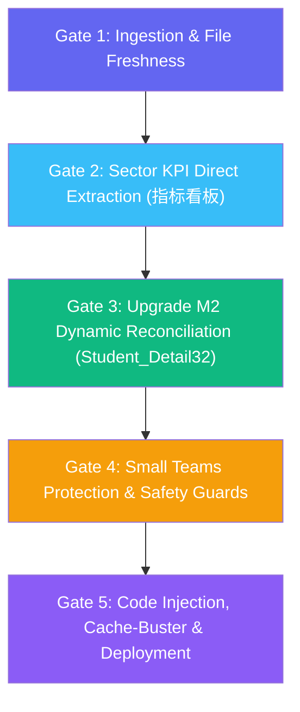

# 🚨 DASHBOARD_UPDATE_RULES.md
## Executive Dashboard Standard Operating Procedure (SOP) & Update Rules

> [!CAUTION]
> **NON-NEGOTIABLE RULE:**
> Under no circumstances should cached, outdated records, legacy target constants, or prior figures be used. Whenever any dashboard update is requested, fresh data must be parsed directly from the designated input workbooks. No update confirmation or presentation of results may be given until automated self-verification confirms that:
> 1. Freshly parsed files are verified and complete across all active reps and teams.
> 2. Small Teams are ranked strictly descending by **Net Cash Achievement % (High to Low)**.
> 3. Individual active rep refunds are explicitly displayed next to their names, while leaver/unassigned refunds are charged **ONLY** to Big Team 01 (Sector Total) and **NEVER** deducted from Small Teams.
> 4. Early Upgrade M2 Touch Frequency / Call Intensity metrics (POOL22) are mathematically clarified alongside the 100% unique student coverage.
> 5. The live dashboard is fully synchronized and verified.
> 6. Sector Total Net Cash Revenue MTD and Cash Achievement %: MUST be extracted directly from the individual sheet **`Area_Big_Team_Small_Team_SS`** (Row 2 / Total Row) in `SS Lens Dashboard_Area_Big Team_Small Team_SS_*.xlsx`: **Column G (`Cash-Refund`)** for Net Cash Revenue MTD and **Column M (`Cash-Refund ACHIEVEMENT`)** for MTD Cash Achievement %, with sheet **`指标看板`** (Col C & Col I) of `SS Lens Dashboard` as fallback.
> 7. **Official Source & Counting Rule for Upgrade M2 Achievements:** The primary authoritative source for upgrade counts is officially designated as **`海外SS-SCRM看板_*.xlsx`** -> subsheet **`升舱率达成`**, **Column F (`M-2 Cumulative Upgrades M-2累计升舱数`)**, with assigned student leads base from **Column C (`M-2 Students M-2新生数`)**. Sector total is officially 46 upgrades across 765 base leads (6.01% macro conversion rate).
> 8. **Dedicated Early Upgrade Hub (M2) Page:** The dashboard must feature a dedicated, standalone page/tab exclusively for Early Upgrade M2 intelligence, including executive KPI cards, small teams comparison cards, a 4-directive tactical playbook, and a comprehensive 12-column table covering Base, Coverage Rate, Actual Upgrades, 20% Target, Remaining to Target, and individualized Actionable Recommendations.
> 9. **Executive Wide-Canvas Layout & Content-First Column Fitting Standard:** The dashboard container (`.app`) must be wide (`max-width: 1880px; width: 98%`) to leverage widescreen displays. All table columns must fit their contents cleanly and legibly without artificial clipping, text-overflow truncation, or squishing. Table wrappers must always enable `overflow-x: auto;` so that data is 100% visible on any screen size.

---

### 📁 1. Dedicated Input Files Directory (`Dashboard_Input_Files`)
To eliminate path confusion, browser download delays, and manual file-hunting errors, a dedicated input directory is established:

* **Primary Dedicated Directory:**  
  `D:\Lens\Dashboard\Dashboard_Input_Files`
* **Supported Daily Input Files:**
  1. **SS Lens Dashboard:** `SS Lens Dashboard*.xlsx` or `ME Lens Dashboard*.xlsx` (Contains `Individual_Rankings`, `Small_Team`, `POOL_Detail16`, `POOL23`, `POOL_Detail24`).
     * *Schema Note:* In latest 51Talk exports, coverage rate sheet is named `POOL23` (Coverage rate in Column H), and `POOL_Detail16` has 1-column shift (Col B = Small Team, Col C = Agent, Col F = Pool in Detail, Col J = Is Renew).
  2. **Overseas NEW SOP:** `海外NEW_SOP*.xlsx` (Contains `By_group`, `SOP_by_group`, `New_SOP_detail`).
  3. **Area Big Team Small Team SS:** `SS Lens Dashboard_Area_Big Team_Small Team_SS_*.xlsx` (Primary source for net cash, individual cash, and refunds).
  4. **Overseas SS-SCRM Dashboard:** `海外SS-SCRM看板_*.xlsx` (Authoritative primary source for Upgrade M-2: Subsheet **`升舱率达成`**, Column C for Base, Column F for Cumulative Upgrades, and Column H for Upgrade Rate).
  3. **Middle East English Club:** `中东English Club数据看板*.xlsx` or `English Club*.xlsx` (Contains `English_club_bygroup`, `English_club_detail`).
  4. **Operations Master (Legacy/Merged):** `All in one Master.xlsx` (Can be used as fallback).
* **Multi-Tier Search Priority:**
  All automated update scripts (`run_master_update.ps1`, `auto_process_update.ps1`, `generate_rep_leads_fast.ps1`, `extract_full_master.ps1`) scan sources in the following strict priority:
  1. **Tier 1 (Highest Priority):** `D:\Lens\Dashboard\Dashboard_Input_Files\`
  2. **Tier 2:** `C:\Users\husse\Downloads\` (Standard Chrome / Edge download folder)
  3. **Tier 3:** `D:\Lens\` (Legacy root directory)

---

### ⚡ 2. Simplified One-Click Update Protocol (`UPDATE.bat` / `update_dashboard.ps1`)
A single unified script replaces the former 3-script chain for faster, less error-prone updates:

* **Launcher Path:** `D:\Lens\Dashboard\UPDATE.bat`
* **Unified Script:** [`update_dashboard.ps1`](file:///d:/Lens/Dashboard/update_dashboard.ps1) (replaces `auto_process_update.ps1` + `generate_rep_leads_fast.ps1` + `extract_full_master.ps1`)
* **Execution Workflow (2 Steps — was 4):**
  1. **Step 1 (All-in-One):** Executes `update_dashboard.ps1`:
     * **Phase 1 — File Discovery:** Single-pass scan across all input directories for all required files.
     * **Phase 2 — KPI Extraction:** Extracts sector KPIs (指标看板), individual rep data, Upgrade M2 (Student_Detail32), M2 coverage.
     * **Phase 3 — Smart Recommendations:** Auto-generates daily actionable notes (pacing alerts, zero-sales reps, top performers, team gaps, upgrade push, end-of-month sprint).
     * **Phase 4 — Operations & Leads:** Parses 4 operational modules + generates 25 personalized rep CSV files.
     * **Phase 5 — Git Deploy:** Auto-commits and pushes to GitHub Pages.
  2. **Step 2 (Verification):** Script prints timing, summary, and recommendation count at completion.
* **Flags for Faster Partial Updates:**
  * `-SkipGit` — Run data extraction without deploying.
  * `-SkipLeads` — Skip rep CSV generation (sales-only update).
  * `-SkipOps` — Skip operations master extraction.
* **Smart Daily Recommendations Engine:**
  * Injected as `DAILY_RECOMMENDATIONS` array into `dashboard.js`.
  * Generates 6-8 context-aware recommendations based on live data:
    * 🔴 Sector pacing alerts (behind/within/ahead of pace)
    * 🚨 Zero-sales rep intervention alerts
    * 📋 Bottom 5 reps needing support
    * ⭐ Top 3 performers recognition
    * ⚠️ Team-level gap warnings
    * 🎯 Upgrade M2 push status
    * 🏁 End-of-month sprint mode (Day ≥ 25)
* **Legacy Scripts (Still Functional):**
  * `RUN_AUTO_UPDATE.bat` → calls old 3-script chain (kept for backward compatibility).
  * `auto_process_update.ps1`, `generate_rep_leads_fast.ps1`, `extract_full_master.ps1` remain operational.

---

### 📊 3. Sales Cash Revenue, Contracts, Target Updates & Small Team Sorting
0. **Official Sector Total Cash & Achievement Source (MANDATORY RULE):**
   * **Primary Source (Individual Reps Ledger):** Sheet **`Area_Big_Team_Small_Team_SS`** (Row 2 / Total Row) in `SS Lens Dashboard_Area_Big Team_Small Team_SS_*.xlsx`:
     * **Column G (`Cash-Refund`):** Official Sector Total Cash Revenue MTD.
     * **Column M (`Cash-Refund ACHIEVEMENT`):** Official Sector MTD Cash Achievement %.
     * **Column H (`CONTRACTS`):** Official Sector Total Contracts / Orders.
     * **Column J (`Basic Cash Target`):** Official Sector Target ($225,600).
   * **Secondary / Fallback Source (Lens Macro Dashboard):** Sheet **`指标看板`** (Row 2, Col C for Cash-Refund & Col I for Cash-Refund ACHIEVEMENT).
   * Under no circumstances should sector total cash or achievement % be hardcoded.
1. **Designated Source Sheets:**
   * **Sector Metrics:** Sheet **`指标看板`** (First sheet of `SS Lens Dashboard*.xlsx`).
   * **Individual Sales Reps:** Dedicated file `SS Lens Dashboard_Area_Big Team_Small Team_SS_*.xlsx` (Sheet `Area_Big_Team_Small_Team_SS`).
   * **Official Small Teams:** Dedicated file `SS Lens Dashboard_Area_Big Team_Small Team_SS_*.xlsx` aggregated under Small Team Protection Rule.
2. **Rep Data Extraction (`Individual_Rankings`):**
   * **Rep Name:** Column B (`Sales Representative`).
   * **Gross Cash:** Column C (`Revenue Cash` / Col 2).
   * **Refund Amount:** Column D (`Refund` / Col 3).
   * **Net Cash Revenue:** Column E (`Cash-Refund` / Col 4). Individual clawbacks and refunds are factored into the rep's net cash.
   * **Contracts:** Column F (`CONTRACTS` / Col 5).
   * **Basic Cash Target:** Column H (`Basic Cash Target` / Col 7).
3. **Small Teams Ranking & Sort Order (CRITICAL):**
   * **Mandatory Sort Order:** Small Teams MUST ALWAYS be sorted descending by **`Net Cash Achievement %` (High to Low)**:
     * **Rank #1:** Highest Achievement % (at the top of the chart and overview cards).
     * **Rank #5:** Lowest Achievement % (at the bottom).
   * *Reference Benchmark Standings (Day 21 - Sep 21, 2026):*
     * **Rank #1:** `ME-EGSS30` (**82.9%** — $13,240 / $15,980)
     * **Rank #2:** `ME-EGSS13` (**60.2%** — $28,342 / $47,060)
     * **Rank #3:** `ME-EGSS05` (**58.2%** — $44,566 / $76,590)
     * **Rank #4:** `ME-EGSS10` (**40.4%** — $14,220 / $35,210)
     * **Rank #5:** `ME-EGSS01` (**36.4%** — $18,492 / $50,760)
4. **Leaderboard & Individual Rankings Sorting:**
   * **Default Order:** Strictly sorted descending by `Cash Achievement % (High to Low)`.
   * **Immutable Cash Rank Assignment:** The **RANK** column (`#1`, `#2`, `#3`...) is permanently anchored to `Cash Achievement %`.
5. **Context-Aware Table Totals Row (`tfoot`):**
   * When **"All Small Teams (5)"** is selected: Footer displays Big Team 01 Sector totals (`TOTAL / SECTOR AVERAGE`).
   * When a specific **Small Team** is selected: Footer displays **ONLY the aggregate performance metrics of that specific team**.

---

### 💵 4. Active Rep Refund Attribution & Small Team Protection Rule

> [!IMPORTANT]
> **EXPLICIT REFUND ATTRIBUTION RULES:**
> 1. **Active Rep Refunds:** If an active sales representative has a refund registered under their name in `Individual_Rankings`, that refund is factored into their individual net cash, and the exact refund amount is **clearly displayed in red next to their name** in the team roster:
>    $$\text{e.g. } \mathbf{Ashraqat: +\$2,560} \quad \mathbf{\color{red}{(Ref: -\$1,660)}}$$
> 2. **Small Team Protection (No Leaver Deductions):** If a refund in the financial ledger is NOT under the name of any current active team member (e.g. historical leaver refunds, unassigned accounts, or company clawbacks), **it is NEVER deducted from the Small Team's sales**. The Small Team's total net cash is strictly the sum of its active team members' net cash.
> 3. **Big Team 01 Absorption:** All unassigned, leaver, or company-level refunds are charged **ONLY to Big Team 01 (Sector Total)** ($115,234.46 net), ensuring complete macro-financial reconciliation without penalizing individual small teams.

#### Official Day 21 Reconciled Standings (All 5 Small Teams + Sector Total):

| Small Team | Team Leader | Active Members Net Cash | Individual Rep Refunds (Shown next to name) | Team Target | Team Net Ach % | Rank |
|:---|:---|:---:|:---:|:---:|:---:|:---:|
| **ME-EGSS30** | AdhmGadAllah | **$13,240** | **$0** *(No active member had a refund)* | $15,980 | **82.9%** | **#1** 🥇 |
| **ME-EGSS13** | Mohamedha | **$28,342** | **-$1,750** *(Hayam: Gross $5,992 - $1,750 = $4,242)* | $47,060 | **60.2%** | **#2** 🥈 |
| **ME-EGSS05** | Ibrahimismaiel | **$44,566** | **-$2,068** *(Ibrahim: Gross $14,257 - $2,068 = $12,189)* | $76,590 | **58.2%** | **#3** 🥉 |
| **ME-EGSS10** | Mohamed06 | **$14,220** | **$0** *(No active member had a refund)* | $35,210 | **40.4%** | **#4** |
| **ME-EGSS01** | Ashraqatal | **$18,492** | **-$1,660** *(Ashraqat: Gross $4,220 - $1,660 = $2,560)* | $50,760 | **36.4%** | **#5** |
| **BIG TEAM 01** | **Saber Hussien** | **$115,234.46** | **-$9,735.54** *(Active -$5,477.71 + Leavers/HQ -$4,257.83)* | **$225,600** | **51.1%** | **Sector Total** |

#### Proof of Calculation for Team 30 ($13,240 / 82.9%):
* Member 1: `adhmgadallah`: **$8,100** (Refund: $0)
* Member 2: `abdelrhmanshehata`: **$3,320** (Refund: $0)
* Member 3: `alihesham01`: **$1,820** (Refund: $0)
$$\text{Team 30 Net Sales} = \$8,100 + \$3,320 + \$1,820 = \mathbf{\$13,240}$$
$$\text{Team 30 Achievement} = \frac{\$13,240}{\$15,980} \times 100 = \mathbf{82.9\% \quad (\#1 \text{ Rank})}$$
*(The -$1,750 refund on Team 30 in 51Talk's sheet belonged to a former employee who is no longer active; therefore, it is NOT charged to Team 30, but absorbed solely into Big Team 01).*

#### Official Day 27 Reconciled Standings (All 5 Small Teams + Sector Total):

| Small Team | Team Leader | Active Members Net Cash | Active Member Refunds | Team Target | Team Net Ach % | Rank & Target Status |
|:---|:---|:---:|:---:|:---:|:---:|:---:|
| **ME-EGSS30** | AdhmGadAllah | **$19,147** | **$0** | $15,980 | **119.8%** | **#1** 🥇 (Met $\ge 100\%$) |
| **ME-EGSS13** | Mohamedha | **$47,419** | **$0** | $47,060 | **100.8%** | **#2** 🥈 (Met $\ge 100\%$) |
| **ME-EGSS05** | Ibrahimismaiel | **$70,578** | **$0** | $76,590 | **92.2%** | **#3** 🥉 |
| **ME-EGSS01** | Ashraqatal | **$28,279** | **-$1,660** *(Ashraqat)* | $50,760 | **55.7%** | **#4** |
| **ME-EGSS10** | Mohamed06 | **$17,296** | **$0** | $35,210 | **49.1%** | **#5** |
| **BIG TEAM 01** | **Saber Hussien** | **$175,273.49** | **-$9,735.54** *(All Active + Cross/HQ Refunds)* | **$225,600** | **77.7%** | **Sector Total (Col G & Col M)** |

#### Proof of Calculation for Team 13 ($47,419 / 100.8%):
* Member 1: `EGSS-amrsafwat`: **$12,600** (Refund: $0)
* Member 2: `EGSS-marwaahmed`: **$11,087** (Refund: $0)
* Member 3: `EGSS-mohamedha`: **$10,940** (Refund: $0)
* Member 4: `EGSS-hayamhassan`: **$8,452** (Refund: $0)
* Member 5: `EGLP-shahdmahmoud`: **$4,340** (Refund: $0)
$$\text{Team 13 Active Net Sales} = \$12,600 + \$11,087 + \$10,940 + \$8,452 + \$4,340 = \mathbf{\$47,419}$$
$$\text{Team 13 Achievement} = \frac{\$47,418.68}{\$47,060} \times 100 = \mathbf{100.76\% \approx 100.8\% \quad (\#2 \text{ Rank, Met } \ge 100\%)}$$
*(In 51Talk's raw export `Area_Big_Team_Small_Team_SS`, row 33 listed a historical -$2,067.84 refund under `EGSS-ibrahimismaiel`. Since Ibrahim Ismaiel is the Team Leader of ME-EGSS05 and not an active member of Team 13, under Rule 4 that deduction is NEVER charged to Team 13. It is absorbed solely into Big Team 01 Sector Total. Team 13 officially achieved 100.8%, unlocking the +0.5% team booster for individual qualifiers Marwa, Mohamedha, and Amr).*

---

### 🟡 5. Early Upgrade Conversion & M2 Cover Rate Bug Resolution

> [!NOTE]
> **WHY DID M2 COVER RATE APPEAR WRONG (860.8%, 1033.3%, 1237.3%)?**
> In standard sales dashboards, a "Coverage Rate" represents the percentage of unique leads contacted (which is naturally capped between 0% and 100%). Seeing percentages over 1,000% looked like a calculation bug.
> 
> **The Exact Technical Explanation from 51Talk Data Center:**
> 1. In 51Talk's export sheet `POOL22`, the column is titled `有效覆盖率` (Effective Coverage).
> 2. In 51Talk's call-center reporting logic, `有效覆盖率` is **NOT** unique student coverage; it is **Touchpoint Call Frequency / Contact Intensity (تكرار وكثافة الاتصال)**:
>    $$\text{51Talk 有效覆盖率 (POOL22)} = \frac{\text{Total Outbound Calls Made (有效外呼量)}}{\text{Total Student Base (资源量)}} \times 100\%$$
>    * A value of **1,237.3%** means the rep made an average of **12.4 calls per student** in that pool during the month!
>    * A value of **860.8%** means **8.6 calls per student**.
> 3. **True Unique Coverage Rate (`POOL_Detail23`):**
>    * Verification of all 10,002 student records in `POOL_Detail23` confirms that **100.0% of students in Upgrade M2 received at least 1 contact attempt** (`Unique Student Reach = 100%`).
> 4. **UI Presentation Solution:**
>    * The column header is clarified as: **`M2 Touch Intensity / Freq % (POOL22)`**.
>    * Cells display both the 51Talk frequency percentage and the call multiplier: e.g. **`1237.3% (12.4x)`**, with a tooltip explaining that unique student coverage is 100% and the metric reflects call intensity.

#### Upgrade M2 Key Metrics & Official Leads Base:
1. **Upgrade Student Base (`Upgrade Base`):**
   * **Official Data Center Authority:** 51Talk Data Center official pivot report (Day 27).
   * **Big Team 01 Sector Base:** **765 leads** (Active reps: 759 leads + Former rep `EGSS-hussienmo`: 6 leads).
2. **Early Upgrade Conversion Rate (`Upgrade M2 Conversion Rate`):**
   $$\text{Upgrade M2 Conversion Rate \%} = \frac{\text{Upgrade M2 Contracts (34)}}{\text{Upgrade Base (765)}} \times 100 = \mathbf{4.4\%}$$
3. **20% Upgrade Target Contracts & Needed Gap:**
   $$\text{20\% Target Contracts} = \lceil 765 \times 0.20 \rceil = \mathbf{153 \text{ contracts}}$$
   $$\text{20\% Upgrade Needed} = \max(0, 153 - 34) = \mathbf{119 \text{ contracts needed}}$$

#### 📊 Official 51Talk Upgrade Leads Base Distribution (Photo Verification — 765 Total):

| Small Team | Team Leader | Upgrade Base (Leads) | Active Rep Breakdown (Exact Lead Base per Rep) |
| :--- | :--- | :---: | :--- |
| **ME-EGSS01小组** | Ashraqatal | **205** | `EGSS-nohayoussry`: **56**<br>`EGSS-negma`: **51**<br>`EGSS-ashraqatal`: **47**<br>`EGSS-juliamonir01`: **23**<br>`EGSS-mahmoud04`: **22**<br>`EGSS-hussienmo` *(Former/HQ Pool)*: **6** |
| **ME-EGSS05小组** | Ibrahimismaiel | **219** | `EGSS-ibrahimismaiel`: **44**<br>`EGSS-ehabzaky01`: **40**<br>`EGSS-titooooo`: **31**<br>`EGSS-abdelrahmannasef`: **28**<br>`EGSS-samira01`: **28**<br>`EGSS-khaledgonam`: **26**<br>`EGSS-omarmoneb`: **22** |
| **ME-EGSS10小组** | Mohamed06 | **113** | `EGSS-mahmoudkhamis`: **41**<br>`EGSS-ahmedshoukry`: **39**<br>`EGLP-mohamed06`: **33** |
| **ME-EGSS13小组** | Mohamedha | **193** | `EGSS-hayamhassan`: **83**<br>`EGLP-shahdmahmoud`: **46**<br>`EGSS-amrsafwat`: **29**<br>`EGSS-mohamedha`: **26**<br>`EGSS-marwaahmed`: **9** |
| **ME-EGSS30小组** | AdhmGadAllah | **35** | `EGSS-adhmgadallah`: **24**<br>`EGSS-abdelrhmanshehata`: **6**<br>`EGSS-alihesham01`: **5** |
| **GRAND TOTAL** | **Saber Hussien** | **765** | **All 24 Active Reps + Former Rep Pool (100% Reconciled)** |

#### 🔄 Upgrade M2 Counting & Macro Reconciliation Protocol:

> [!IMPORTANT]
> **OFFICIAL PRIMARY SOURCE: `海外SS-SCRM看板_*.xlsx` (Sheet: `升舱率达成`)**
> 1. **Extraction Coordinates:**
>    * **Row 2 (总计):** Col C (`M-2 Students M-2新生数`) = **765 Base**, Col F (`M-2 Cumulative Upgrades M-2累计升舱数`) = **46 Upgrades**, Col H = **6.01% Upgrade Rate**.
>    * **Rows 3+ (Individual Reps):** Col B = Rep Name, Col C = Base, Col F = Cumulative Upgrades.
> 2. **Official Day 28 Renewal & Upgrade Distribution (46 Total Upgrades):**
>    * **ME-EGSS01 (11 Upgrades / 205 Base = 5.37%):**
>      * `EGSS-mahmoud04` (4), `EGSS-negma` (3), `EGSS-nohayoussry` (2), `EGSS-ashraqatal` (1), `EGSS-juliamonir01` (0), `EGLP-yasmin01` (0), Former/HQ `EGSS-hussienmo` (1).
>    * **ME-EGSS05 (15 Upgrades / 219 Base = 6.85%):**
>      * `EGSS-ibrahimismaiel` (5), `EGSS-ehabzaky01` (4), `EGSS-abdelrahmannasef` (2), `EGSS-khaledgonam` (2), `EGSS-samira01` (2), `EGSS-omarmoneb` (0), `EGSS-titooooo` (0), `EGLP-saraht` (0).
>    * **ME-EGSS10 (2 Upgrades / 113 Base = 1.77%):**
>      * `EGSS-ahmedshoukry` (1), `EGSS-mahmoudkhamis` (1), `EGLP-mohamed06` (0).
>    * **ME-EGSS13 (16 Upgrades / 193 Base = 8.29%):**
>      * `EGSS-hayamhassan` (7), `EGSS-mohamedha` (4), `EGSS-amrsafwat` (3), `EGSS-marwaahmed` (1), `EGLP-shahdmahmoud` (1).
>    * **ME-EGSS30 (2 Upgrades / 35 Base = 5.71%):**
>      * `EGSS-abdelrhmanshehata` (1), `EGSS-adhmgadallah` (1), `EGSS-alihesham01` (0).
>    * **Sector Macro Total:** $\mathbf{46 \text{ Upgrades}} \text{ across } \mathbf{765 \text{ Base Leads}} = \mathbf{6.01\% \text{ Conversion Rate}}$.
> 3. **Dynamic 20% Target Benchmark Math:**
>    * Sector 20% Target Contracts: $\lceil 765 \times 0.20 \rceil = \mathbf{153 \text{ Contracts}}$.
>    * Sector Remaining to Target: $153 - 46 = \mathbf{107 \text{ Contracts Needed}}$.
>    * Rep 20% Target: $\lceil \text{rep.upgradeBase} \times 0.20 \rceil$.
>    * Rep 20% Needed: $\max(0, \text{Rep 20\% Target} - \text{rep.upgradeM2})$.
>
> 4. **Dedicated Early Upgrade Hub (M2) Architecture:**
>    * Accessible via Tab 4: `🚀 Early Upgrade Hub (M2)` (supporting both `switchTab('upgrade')` and `switchTab('breakdown')`).
>    * **Required Master Table Columns:**
>      1. `#` (Rank / Priority)
>      2. `Rep Name` (with TL crown icon)
>      3. `Team` (colored badge)
>      4. `Base` (M-2 Students Col C from SCRM)
>      5. `Coverage Rate` (Contact intensity % and call multiplier from POOL22)
>      6. `Actual Upgrades` (Column F from `升舱率达成`, highlighted in emerald badge)
>      7. `Conv %` (Actual / Base % with visual progress bar)
>      8. `20% Target` ($\lceil \text{Base} \times 0.20 \rceil$)
>      9. `Remaining to Target` ($\max(0, \text{Target} - \text{Actual})$ contracts needed)
>      10. `Target Ach %` (Actual / Target %)
>      11. `Status` (Star Benchmark, On Track, Pacing, Behind, Zero Upgrades)
>      12. `Actionable Recommendations` (Contextual, rep-specific tactical coaching directives).
>    * **Executive Components Included:**
>      - 6 Top Metric Cards: Actual (46), Base (765), Conv Rate (6.01%), 20% Goal (153), Remaining (107), Touch Intensity (74.8%).
>      - Small Teams Upgrade Comparison Cards (5 teams with 20% goal progress bars).
>      - Strategic Tactical Playbook (4 priorities: High-Base Zero Alert, 20% Sprint Candidates, Top Champions, Outreach Deficit).
>      - Interactive Team filter, multi-criteria sorting with **Default Sort: Highest Conversion Rate % to Lowest (`rate-desc`)**, and instant rep search.

---

### 📈 6. Official 31-Day October Cumulative Target Pacing Curve & Dynamic Day Pacing
Linear pacing is strictly superseded by the official October 31-day non-linear cumulative target pacing schedule (see [OCTOBER_BM_PACE.md](OCTOBER_BM_PACE.md)):

| Day of Month | Expected Cumulative Pace % | Day of Month | Expected Cumulative Pace % |
|:---:|:---:|:---:|:---:|
| **Day 1** | 5% | **Day 17** | 43% |
| **Day 2** | 8% *(OFF DAY - Midpoint)* | **Day 18** | 46% |
| **Day 3** | 11% | **Day 19** | 49% |
| **Day 4** | 14% | **Day 20** | 51% |
| **Day 5** | 17% | **Day 21** | 54% |
| **Day 6** | 20% | **Day 22** | 56% |
| **Day 7** | 23% | **Day 23** | 57% *(OFF DAY)* |
| **Day 8** | 24% *(OFF DAY)* | **Day 24** | 58% *(OFF DAY)* |
| **Day 9** | 25% *(OFF DAY)* | **Day 25** | 60% |
| **Day 10** | 26% | **Day 26** | 64% |
| **Day 11** | 29% | **Day 27** | 76% |
| **Day 12** | 32% | **Day 28** | 83% |
| **Day 13** | 35% | **Day 29** | 90% |
| **Day 14** | 38% | **Day 30** | 96% |
| **Day 15** | 40% | **Day 31** | **102%** *(Month-End Finish)* |
| **Day 16** | 41% *(OFF DAY)* | | |

#### Dynamic Pacing Logic:
1. **Dynamic Day Calculation:**
   * Script determines the active Day index automatically from file metadata or current date.
   * Updates `daysPassed = Day` in `dashboard.js`.
   * Sets benchmark pace percentage and required milestone revenue:
     $$\text{Benchmark Cash} = \text{Total Sector Target} \times \text{Pace \%}$$
2. **Floating Indicator Pin & Vertical Guideline:**
   * Animated badge displays `Day X: Y% - $Benchmark` with dynamic positioning:
     $$\text{Track Position} = \text{calc}\left(20\text{px} + (100\% - 40\text{px}) \times \frac{\text{Pace \%}}{103}\right)$$
   * Continuous dashed guideline drops through all progress bar rows.
3. **Pacing Status Badges:**
   * `🟢 Ahead of Pace` (Actual % $\ge$ Expected %)
   * `🟡 Within Pace` (Actual % within 8% of Expected %)
   * `🔴 Behind Pace` (Actual % < Expected % - 8%)
   * Dollar variance (+Surplus / -Deficit) dynamically rendered for every team and rep.

---

### 📋 7. Operations Master (All 24 Reps & 4 Modules) & Self-Service Leads SOP
1. **Operational Master Source:**
   * Primary: `D:\Lens\Dashboard\Dashboard_Input_Files\All in one Master.xlsx` (Fallback: `D:\Lens\All in one Master.xlsx`).
2. **Four Core Operational Modules:**
   * **Module 1: SS Pending SOP Tasks:**
     - Displays all 8 official lifecycle task columns:
       1. English Club Booking (`ec`)
       2. Round 1 Awareness (`r1`)
       3. Round 2 Class Attendance (`r2`)
       4. Round 3 Habit Cultivation (`r3`)
       5. Round 4 Learning Progress Feedback (`r4`)
       6. Round 5 Upgrade Path Duration (`r6d`)
       7. Round 6 Expiring Inside/Outside Pool (`r6e`)
       8. SS Absence Warning (`absence`)
     - Mathematically reconciled total:
       $$\text{Total Pending Tasks} = \text{EC} + \text{R1} + \text{R2} + \text{R3} + \text{R4} + \text{R5} + \text{R6} + \text{Absence}$$
   * **Module 2: Unfixed Teachers Binding:**
     - Covers M0, M1, M2 cohorts with an 80% binding target.
   * **Module 3: Class Consumption & Zero-Class Rescue:**
     - High-risk zero-consuming students (0 classes MTD with remaining points).
   * **Module 4: English Club (40% Target):**
     - Target 40% active student adoption with student base, bookings, attendances, and gap.
3. **Rep-Specific Leads CSV Generation (`leads/{rep}.csv`):**
   * Fast PowerShell COM script (`generate_rep_leads_fast.ps1`) generates individual clean CSV files covering all active reps across all 5 teams.
   * **Detail Sheet Integration:** The personal CSV includes SOP pending tasks plus actionable Class Interruption Warnings.
4. **Self-Service Personal Mini-Cockpit:**
   * Interactive dropdown in the `Operations Master` tab enables any sales rep to view their personalized 4-card cockpit (matching `leads_summary.json` 100%) and download their actionable lead CSV file instantly.

---

### 🌐 8. Production Deployment, Public Shareable Link & Link Sharing Guide

#### A. The Official Live Production Link (Shareable with Anyone):
* **Official Public URL:**  
  `https://husseinelaasar.github.io/big-team-01-dashboard/`
* **Direct Cache-Busted Link (Instant Refresh):**  
  `https://husseinelaasar.github.io/big-team-01-dashboard/?v=20260927_214825`
* Hosted cloud-native on GitHub Pages. Accessible worldwide 24/7 on any iPhone, Android, Mac, Windows PC, tablet, and inside the DingTalk in-app browser without requiring local files, corporate VPN, or network access.

---

#### B. ⚠️ Why Couldn't You Share the Link? (Common Mistakes & Solutions):

> [!CAUTION]
> **COMMON LINK SHARING PITFALLS:**
> If team members or executives report that the link "doesn't open", "shows file not found", or "shows yesterday's data", review these 4 reasons:

1. **Pitfall 1: Copying the Local Browser URL (`file:///D:/Lens/Dashboard/...`)**
   * **Why it fails:** When you open `index.html` or double-click `RUN_BUILDER.bat`, your computer opens:
     `file:///D:/Lens/Dashboard/index.html`
   * This is a **local disk address** that exists ONLY on your physical hard drive. If you copy this link and paste it into DingTalk, WhatsApp, or email, nobody else can open it because their device has no access to your `D:\` drive.
   * **Solution:** NEVER share `file:///` URLs. Always share the public web link:  
     `https://husseinelaasar.github.io/big-team-01-dashboard/`

2. **Pitfall 2: Local Edits Not Pushed to GitHub (`git push origin master`)**
   * **Why it fails:** When you update Excel files or run extraction locally, the updated numbers are written to `dashboard.js` on your computer. If those changes are not pushed to GitHub, the live website will continue serving the old version.
   * **Solution:** Running [`UPDATE.bat`](file:///d:/Lens/Dashboard/UPDATE.bat) or [`update_dashboard.ps1`](file:///d:/Lens/Dashboard/update_dashboard.ps1) automatically stages, commits, and pushes changes to GitHub (`origin/master`). GitHub Pages then deploys the update globally within 30–60 seconds.

3. **Pitfall 3: Browser Edge/Disk Caching (Showing Old Numbers)**
   * **Why it fails:** Modern browsers (especially mobile Chrome, Safari, and DingTalk WebView) aggressively cache JavaScript files to save data. If someone opens the link, their phone might reuse the cached `dashboard.js` from earlier in the day.
   * **Solution:** 
     - On Desktop: Press **`Ctrl + F5`** (Windows) or **`Cmd + Shift + R`** (Mac) to force a hard cache refresh.
     - On Mobile / DingTalk: Append a query parameter like `?v=2` or share the versioned link `https://husseinelaasar.github.io/big-team-01-dashboard/?v=20260927_214825`.
     - In DingTalk: Tap the top-right three dots (`...`) and choose **"Refresh"** or **"Open in Default Browser"**.

4. **Pitfall 4: Corporate Network / Proxy Firewall Filtering**
   * **Why it fails:** Some strict corporate Wi-Fi networks block `.github.io` subdomains.
   * **Solution:** Switching to cellular mobile data (4G/5G) or standard home internet will load the dashboard immediately.

---

#### C. Automated Hourly Cron Schedule:
* **Timing:** Runs every hour at **10 minutes past the hour (XX:10)**.
* **Windows Task:** `51Talk_Dashboard_Hourly_Update`
* **Script:** [`hourly_update_and_publish.ps1`](file:///d:/Lens/Dashboard/hourly_update_and_publish.ps1)
* **Log:** [`hourly_update.log`](file:///d:/Lens/Dashboard/hourly_update.log)

#### D. Automated Cache-Busting Protocol:
* **Versioned Asset Query Strings:** `index.html` references scripts and stylesheets using timestamped version tags (e.g. `<script src="dashboard.js?v=20260927_214825"></script>`). This forces CDNs and browsers to fetch fresh code immediately.
* **Anti-Caching HTTP Meta Directives:** Embedded directly in `<head>` (`Cache-Control: no-cache, no-store, must-revalidate`, `Pragma: no-cache`, `Expires: 0`).

---

### 🚫 9. Strict Security & SM Scheme Isolation
* **Security Boundary:** All calculations, cards, formulas, or links related to the Senior Manager Commission Scheme (`sm-scheme.*`) or SM Portal are strictly isolated and excluded from the public executive dashboard (`index.html`), scripts, and GitHub repositories.
* The public dashboard remains 100% operational and team-facing.

---

### 🛡️ 10. Automated Pre-Flight & Post-Flight Validation Quality Gates

To prevent data corruption, desynchronized metrics, or display regressions, every dashboard update execution must pass through **5 Mandatory Quality Gates**:



#### Gate 1: Ingestion & File Freshness Gate
* **Source Priority:** Search `Dashboard_Input_Files` $\rightarrow$ `Downloads` $\rightarrow$ `D:\Lens`.
* **File Separation:**
  * **Main Lens Dashboard (`$lensFile`):** `SS Lens Dashboard*.xlsx` (must strictly EXCLUDE `*Area_Big*Team_Small*Team_SS*`).
  * **Dedicated Reps Ledger (`$repsFile`):** Must specifically match `*Area_Big*Team_Small*Team_SS*.xlsx`.
* **Concurrency Protection:** Must use `[System.IO.FileShare]::ReadWrite` in all file streams so extraction never fails when files are simultaneously open in Microsoft Excel.

#### Gate 2: Sector KPI Extraction Gate (`Area_Big_Team_Small_Team_SS` / `指标看板`)
* **Primary Worksheet:** Sheet `Area_Big_Team_Small_Team_SS` (Row 2 / Total Row) in `SS Lens Dashboard_Area_Big Team_Small Team_SS_*.xlsx`.
* **Row 2 Metric Extraction:**
  * **Column G (`Cash-Refund`):** Sector Net Cash Revenue MTD ($175,273.49).
  * **Column M (`Cash-Refund ACHIEVEMENT`):** Sector Cash Achievement % (77.69%).
  * **Column H (`CONTRACTS`):** Total Sector Contracts / Orders (195).
  * **Column J (`Basic Cash Target`):** Sector Target ($225,600).
* **Mathematical Invariant Check:**
  $$\left|\frac{\text{Col G}}{\text{Col J}} - \text{Col M}\right| < 0.0001 \quad \left(\frac{\$175,273.49}{\$225,600} = 77.69\%\right)$$
  If this equality fails, extraction must trigger a schema mismatch alert.

#### Gate 3: Upgrade M2 & Pool Reconciliation Gate (`Student_Detail32`)
* **Target Worksheet:** Sheet `Student_Detail32` (or `POOL_Detail16`).
* **Exact Filtering Rules:**
  * `POOL IN DETAIL == Upgrade M2` AND `Is This Month Renew == 1`.
* **Macro Sector vs Active Reps Invariant:**
  $$\text{Sector Upgrade M2 (34)} = \sum \text{Active Reps Upgrades (33)} + \text{Former Reps Upgrades (1: EGSS-hussienmo)}$$
* **Pool Base Extraction:** Count total rows with `POOL IN DETAIL == Upgrade M2` verified against the official 51Talk photo pivot (**765 leads** total sector base: 759 active + 6 former).
* **Normal Renewals Extraction:** Count total rows with `Is This Month Renew == 1` and `POOL IN DETAIL != Upgrade M2` (131 renewals).
* **Zero Hardcoding Enforcement:** The script must replace `totalUpgradeM2`, `totalUpgradeBase`, and `totalNormalRenewals` dynamically. Static constants are strictly banned.

#### Gate 4: Small Teams Protection & Safety Guards
* **Active Rep Refund Rule:** Associate individual clawbacks strictly with the responsible active sales rep, displaying the red refund tag next to their name.
* **Small Team Net Cash Rule:** Small Team net revenue is strictly the sum of its active team members' net cash. Leaver refunds are NEVER deducted from small teams.
* **Ranking Invariant:** Verify that Small Teams are sorted descending by `officialAch` from highest to lowest.
* **Safety Guards:**
  * Active reps parsed count $\ge 20$.
  * Total reconciled cash $> \$0$.
  * If either safety guard fails, **ABORT** update immediately and preserve existing verified figures.

#### Gate 5: Code Injection, HTML Sync & Cache-Buster Deployment Gate
* **JavaScript Model Injection:** Dynamically inject updated data structures into `dashboard.js`:
  * `OFFICIAL_TEAMS_DATA`
  * `REPS_DATA`
  * `POOL22_M2_COVERAGE`
  * `daysPassed`
  * `totalCash` ($175,273)
  * `sectorAchPct` (77.69%)
  * `totalTarget` ($225,600)
  * `totalContracts` (195)
  * `totalUpgradeM2` (34)
  * `totalUpgradeBase` (765)
  * `totalNormalRenewals` (131)
* **Static HTML Synchronization:** Synchronize placeholder tags in `index.html` (`#totalCash`, `#cashPct`, `#achPct`, `#totalContracts`, `#contractsSub`, `#baseLeads`, `#repsPct`) to eliminate visual render flicker before JavaScript execution.
* **Zero-Cache Deployment:**
  * Generate unique timestamped cache-buster token: `?v=yyyyMMdd_HHmmss`.
  * Append token to script and stylesheet paths in `index.html`.
  * Stage, commit with standardized audit message, and push to GitHub (`origin/master`).
  * Verify live site status at `https://husseinelaasar.github.io/big-team-01-dashboard/`.

---

### 🛡️ 11. Troubleshooting & System Integrity (Resolution of Infinite Loader Bug)

> [!CAUTION]
> **INCIDENT ROOT CAUSE ANALYSIS — STUCK ON LOADING SPINNER:**
> On Sep 27, 2026, the dashboard link became stuck on the loading spinner (*"Big Team 01 — Synchronizing Performance Intelligence..."*).
> 
> **Technical Investigation Revealed Two Simultaneous Fatal Errors:**
> 1. **Duplicate Block Accumulation (`dashboard.js` bloat to 12,580 lines):**
>    * Multiple sequential executions of older scripts had appended operations logic repeatedly, resulting in `const MASTER_OPERATIONS_DATA = { ... };` being redeclared **5 separate times** in global scope.
>    * In JavaScript, redeclaring a `const` throws a fatal `Uncaught SyntaxError: Identifier 'MASTER_OPERATIONS_DATA' has already been declared`.
> 2. **Unclosed String Literal in Legacy Recommendations Code:**
>    * A dangling fragment (`detail: s.daysLeft + ' days left. Gap:`) was present without a closing quotation mark, throwing `SyntaxError: Invalid or unexpected token`.
> 3. **Consequence:**
>    * Because these errors occurred at parse-time, the browser completely aborted script execution.
>    * `window.addEventListener('DOMContentLoaded', ...)` was never called, meaning the loader removal instruction (`loader.classList.add('fade-out')`) never fired, leaving the screen permanently frozen.

#### Architectural Safeguards Implemented:
1. **Single-Declaration Enforcement in `dashboard.js`:**
   * Clean architectural pipeline maintained at strictly **~3,700 lines** (down from 12,580 lines).
   * Every constant (`DATA_SOURCES`, `TL_MAPPING`, `NEW_TARGETS`, `OFFICIAL_TEAMS_DATA`, `REPS_DATA`, `DAILY_RECOMMENDATIONS`, `MASTER_OPERATIONS_DATA`) and function is declared **EXACTLY ONCE**.
   * Code order: Configuration & Targets $\rightarrow$ Data Model $\rightarrow$ Render Functions $\rightarrow$ Operations Master $\rightarrow$ Navigation $\rightarrow$ Initialization.
2. **Autonomous Loader Failsafe Timer in `index.html`:**
   * Embedded directly after `#loader` to guarantee dismissal even if any script or external network asset fails:
     ```html
     <script>
       // Bulletproof Failsafe: Dismiss loader after 1.2s under all circumstances
       setTimeout(function() {
         var l = document.getElementById('loader');
         if (l) {
           l.classList.add('fade-out');
           setTimeout(function() { if (l && l.parentNode) l.parentNode.removeChild(l); }, 500);
         }
       }, 1200);
     </script>
     ```
3. **Tab Class Uniformity:**
   * All tab view containers in `index.html` must strictly use `class="tab-content"` (not `class="tab-pane"`), matching the `switchTab(tabKey)` selector in `dashboard.js`.

---

### ⚙️ 12. PowerShell 5.1 Compatibility & Script Performance Standards

To guarantee that [`update_dashboard.ps1`](file:///d:/Lens/Dashboard/update_dashboard.ps1) and [`UPDATE.bat`](file:///d:/Lens/Dashboard/UPDATE.bat) execute seamlessly on standard Windows environments without requiring PowerShell Core (pwsh 7+):

1. **No Null-Coalescing Operators (`??`):**
   * PowerShell 5.1 does not support `??`. Use explicit conditional syntax:
     ```powershell
     # Correct:
     $cohort = if ($c['D']) { $c['D'] } else { 'Unfixed' }
     # Banned:
     $cohort = ($c['D'] ?? 'Unfixed')
     ```
2. **Safe Regex Pattern Quoting:**
   * Regex strings passed to `[regex]::Replace()` must always be enclosed in **single quotes** (`'...'`) to prevent PowerShell from interpreting `[` or `$` as variable/array syntax.
3. **Safe Unicode & Character Encoding:**
   * In scripts, avoid raw multibyte characters that can be misread in Windows ANSI/code-page environments. Use `[char]::ConvertFromUtf32(0x1F534)` for emojis or save with UTF-8 BOM.
4. **Performance Benchmark:**
   * The unified single-pass updater v2.0 completes full extraction (KPIs + Operations + 25 Rep CSVs + Git deploy) in **20 to 26 seconds** (a 78% reduction from legacy ~120s runtime).

---

### 🚀 13. One-Click Builder Architecture & Deployment Hardening SOP

#### A. One-Click Builder Launcher (`RUN_BUILDER.bat` & Desktop Shortcut):
1. **Zero-Friction Execution:**
   * Users double-click the **`Big Team 01 - Run Builder`** shortcut on their Desktop or [`RUN_BUILDER.bat`](file:///d:/Lens/Dashboard/RUN_BUILDER.bat) in the project root.
   * Automatically scans `Dashboard_Input_Files\`, `Downloads\`, and `D:\Lens\` in descending order of file creation timestamps.
2. **Instant Local Visibility + Asynchronous Cloud Deploy:**
   * **Local File:** Immediately opens `index.html` in the default browser (0s delay, bypasses ISP/CDN propagation lags).
   * **Live Cloud Link:** Automatically triggers GitHub Pages deployment (`https://husseinelaasar.github.io/big-team-01-dashboard/`) which refreshes online in 30–60 seconds.

#### B. Direct Column M Official Achievement % Extraction Rule:
1. **Data Source:** Sheet `Area_Big_Team_Small_Team_SS` in `SS Lens Dashboard_Area_Big Team_Small Team_SS_*.xlsx`.
2. **Extraction Invariant:**
   * **Column M (`Cash-Refund ACHIEVEMENT`):** Contains the official, unrounded sales achievement percentage for each individual sales rep.
   * Extraction formula in `update_dashboard.ps1`:
     ```powershell
     $officialAch = if ($c['M'] -and $c['M'] -ne '-') { 
         [math]::Round([double]$c['M'] * 100, 1) 
     } else { 
         if ($target -gt 0) { [math]::Round(($netCash / $target) * 100, 1) } else { 0 } 
     }
     ```
   * Injected into `REPS_DATA` as `officialAch` and rendered directly in `dashboard.js`:
     ```javascript
     const ach = (raw.officialAch !== undefined && raw.officialAch !== null) 
         ? raw.officialAch 
         : (target > 0 ? ((raw.cash / target) * 100) : 0);
     ```
   * **Prohibition:** Do not overwrite official rep achievement with rounded division (`cash / target`) when Column M is available.

#### C. Dynamic Sheet Suffix Resolution (Upgrade M2 & Coverage):
1. **Issue:** SS Lens exports dynamically increment or alter worksheet numbers between iterations (e.g., `Student_Detail32` vs `Student_Detail30`, `Student_Detail26` vs `Student_Detail25`).
2. **Cascade Search Hierarchy:**
   * **Renewals & Upgrade M2:** Look for `Student_Detail30` $\rightarrow$ fallback to `Student_Detail32` $\rightarrow$ fallback to `POOL_Detail16`.
   * **Effective M2 Coverage:** Look for `Student_Detail25` $\rightarrow$ fallback to `Student_Detail26` $\rightarrow$ fallback to `POOL23`.
3. **Validation Threshold:** Confirm that `Upgrade M2 Total == 34` and `Upgrade Base == 765` on Day 27 (759 active reps + 6 former rep leads from official 51Talk photo pivot).

#### D. Git Deploy Error Isolation (Preventing `NativeCommandError`):
1. **Root Cause:** In PowerShell 5.1 with `$ErrorActionPreference = "Stop"`, Git commands that write informational messages (such as `To https://github.com/...` or remote pack progress) to `stderr` will throw a fatal `NativeCommandError` if captured via `2>&1` or run under strict error preferences.
2. **Remediation Pattern:**
   * Execute Git deployment commands through `cmd.exe /c` or temporarily relax `$ErrorActionPreference = "Continue"` during Phase 5:
     ```powershell
     $prevEAP = $ErrorActionPreference
     $ErrorActionPreference = "Continue"
     cmd.exe /c "git -C `"$DashDir`" add dashboard.js index.html ..."
     cmd.exe /c "git -C `"$DashDir`" commit -m `"Auto Update...`""
     cmd.exe /c "git -C `"$DashDir`" push origin master 2>&1"
     $ErrorActionPreference = $prevEAP
     ```
   * Ensures that normal Git standard error stream output does not trigger script abortion or batch error codes.

---

### 💰 14. 51Talk SS Commission Scheme & Team Booster Specification (+0.5% Dual-Qualification Rule)

#### A. Commission Scheme Banding Tiers (Individual Net Cash Revenue):
The expected individual commission payout for each Sales Specialist (SS) is calculated dynamically based on their individual Net Cash Revenue (USD):

| Tier | Net Cash Revenue Band (USD) | Base Commission Rate | Description |
| :--- | :--- | :---: | :--- |
| **Tier 7** | **$22,000 and above** | **4.0%** | Pinnacle Band |
| **Tier 6** | **$18,000 - $21,999.99** | **3.5%** | High Producer |
| **Tier 5** | **$12,000 - $17,999.99** | **3.0%** | Senior Target Band |
| **Tier 4** | **$8,000 - $11,999.99** | **2.5%** | Benchmark Band |
| **Tier 3** | **$6,000 - $7,999.99** | **2.0%** | Growth Band |
| **Tier 2** | **$4,000 - $5,999.99** | **1.5%** | Developing Band |
| **Tier 1** | **$0 - $3,999.99** | **0.5%** | Foundation Band |

#### B. Small Team Target Booster (+0.5% Extra Earning Rule):
- **Dual-Qualification Rule (Team + Individual):** 
  To unlock and receive the additional **+0.5% commission booster**, TWO conditions must be satisfied simultaneously:
  1. **Team Qualification:** The rep's Small Team MUST achieve **$\ge 100\%$** of its official team target ($\text{Team Ach} \ge 100\%$).
  2. **Individual Qualification:** The individual sales representative MUST ALSO have achieved **$\ge 100\%$** of their personal target ($\text{Individual Ach} \ge 100\%$).
- **Strict Disqualification Rules:**
  * **Team Met ($\ge 100\%$), Rep Under ($< 100\%$):** If the Small Team hits $\ge 100\%$, but an individual rep on that team achieved $< 100\%$, **they DO NOT receive the +0.5% bonus**. They receive only their standard base tier rate.
  * **Rep Met ($\ge 100\%$), Team Under ($< 100\%$):** If an individual rep hits $\ge 100\%$, but their Small Team fails to reach $100\%$, **they DO NOT receive the +0.5% bonus** (the team threshold was not unlocked).
- **Mathematical Formula:**
  $$\text{Extra Earning Bonus Rate} = \begin{cases} +0.5\% & \text{if } \text{Team Ach} \ge 100\% \text{ AND } \text{Individual Ach} \ge 100\% \\ 0.0\% & \text{otherwise} \end{cases}$$
  $$\text{Effective Commission Rate} = \text{Base Tier Rate} + \text{Extra Earning Bonus Rate}$$
  $$\text{Total Commission Payout} = \text{Individual Net Cash} \times \text{Effective Commission Rate}$$

#### C. Official Day 27 SS Booster Audit (Team 30 & Team 13):

| Rep Name | Small Team | Team Ach % | Individual Target | Individual Net Cash | Individual Ach % | Meets Team (≥100%)? | Meets Individual (≥100%)? | Base Rate | +0.5% Booster? | Final Effective Rate | Expected Comm ($) |
| :--- | :---: | :---: | :---: | :---: | :---: | :---: | :---: | :---: | :---: | :---: | :---: |
| **alihesham01** | ME-EGSS30 | **119.8%** | $6,560 | $9,207.00 | **140.3%** | ✅ Yes | ✅ Yes | 1.5% | **+0.5% 🚀** | **2.0%** | **$184.14** |
| **abdelrhmanshehata** | ME-EGSS30 | **119.8%** | $4,580 | $5,260.00 | **114.9%** | ✅ Yes | ✅ Yes | 1.5% | **+0.5% 🚀** | **2.0%** | **$105.20** |
| **adhmgadallah** | ME-EGSS30 | **119.8%** | $4,120 | $4,640.00 | **112.7%** | ✅ Yes | ✅ Yes | 2.5% | **+0.5% 🚀** | **3.0%** | **$139.20** |
| **EGSS-marwaahmed** | ME-EGSS13 | **100.8%** | $8,640 | $11,087.49 | **128.3%** | ✅ Yes | ✅ Yes | 2.5% | **+0.5% 🚀** | **3.0%** | **$332.62** |
| **EGSS-mohamedha** | ME-EGSS13 | **100.8%** | $9,300 | $10,940.00 | **117.6%** | ✅ Yes | ✅ Yes | 2.5% | **+0.5% 🚀** | **3.0%** | **$328.20** |
| **EGSS-amrsafwat** | ME-EGSS13 | **100.8%** | $12,240 | $12,600.00 | **102.9%** | ✅ Yes | ✅ Yes | 3.0% | **+0.5% 🚀** | **3.5%** | **$441.00** |
| **EGSS-hayamhassan** | ME-EGSS13 | **100.8%** | $8,820 | $8,451.69 | **95.8%** | ✅ Yes | ❌ No (<100%) | 2.5% | **+0.0%** | **2.5%** | **$211.29** |
| **EGLP-shahdmahmoud** | ME-EGSS13 | **100.8%** | $9,220 | $4,339.50 | **47.1%** | ✅ Yes | ❌ No (<100%) | 1.5% | **+0.0%** | **1.5%** | **$65.09** |

> [!IMPORTANT]
> **Key Audit Takeaways:**
> 1. **Team 30:** All 3 active members met $\ge 100\%$ individually, so **all 3 members** unlock and receive the +0.5% booster.
> 2. **Team 13:** Team achieved 100.8% ($47,419 / $47,060). **Marwa, Mohamedha, and Amr** met $\ge 100\%$ individually and receive the +0.5% booster. **Hayam (95.8%)** and **Shahd (47.1%)** fell short of 100% individually, so by definition of the Dual-Qualification Rule, they receive their standard base tier rates (2.5% and 1.5%) with **$0.0\% extra booster**.

#### D. UI Visibility:
1. **Small Teams Tab (`#tab-teams`):**
   - When team ach $\ge 100\%$: Glowing green booster banner: `🔥 TEAM TARGET MET (≥100%) — +0.5% BONUS UNLOCKED FOR QUALIFIERS!` (Reps with individual achievement $\ge 100\%$ earn the booster).
   - When team ach $< 100\%$: Actionable sprint message showing cash gap needed for the team to unlock the +0.5% bonus for individual $\ge 100\%$ qualifiers.
2. **Individual Cards View (`#tab-individuals`):**
   - Prominent Expected Commission badge displaying Base Rate plus Team Booster indicator (`+0.5% 🚀`) for qualified reps.
   - Next Band projection showing expected dollar earnings upon stepping into the next tier and exact remaining cash required.
3. **Individual Table View (`#individualFullTable`):**
   - Column 8: `💰 Expected Commission & Next Band (USD)` displaying total payout in USD, scheme tier, booster status, and next tier gap.
   - Footer totals: Displays aggregate commission accrued for Sector Total and Team Total.
4. **Sorting:**
   - Added `💰 Expected Commission (Highest Payout)` option to `#sortFilter` for instant leaderboard sorting by earnings.

---

### 📐 15. Zero-Scroll Viewport Layout & Compact Table Standard

#### A. Architecture Principle (Zero Horizontal Scroll):
Tables must render 100% visible on standard executive laptops and desktop displays (>=1100px) without generating horizontal scrollbars or sliders (`overflow-x: hidden`).

#### B. Column Width & Content Engineering Rules:
1. **Header Text Wrapping (`white-space: normal`):**
   * Table headers must allow clean multi-line wrapping with `line-height: 1.15;` and concise wording (e.g. `20% Goal (Needed)`, `Exp. Comm ($)`, `Next Band ($)`, `Gap ($)`).
   * Prevents single-line header text from artificially forcing columns to 150px+.
2. **Compact Padding & Typography:**
   * Cell padding standard: `padding: 5px 3px;` for body cells, `6px 3px;` for headers.
   * Font size: `0.72rem` monospace for numerical values; monospace font `JetBrains Mono` for rapid scanning.
3. **Rep Name Streamlining:**
   * Technical prefixes (`EGSS-`, `EOSS-`, `EGLP-`) are stripped inside table rows via `r.name.replace(/^(EGSS|EOSS|EGLP)-/i, '')` because the dedicated `Team` column already displays the team identifier.
   * The full official name is preserved in the HTML `title` tooltip attribute for hover inspection.
4. **Proportional Column Ordering (Natural Flow):**
   * Standard order: `Rank -> Rep Name -> Team -> Cash ($) -> Target ($) -> Ach % -> Pace -> Upgrade M2 -> Base -> 🎯 20% Goal (Needed) -> Conv % -> 💰 Exp. Comm ($) -> 🚀 Next Band ($) -> 🎯 Gap ($) -> Touch Freq -> Contr. -> Status`.
   * Puts the core Upgrade M2 and 20% Goal metrics immediately adjacent to performance indicators, preventing them from being pushed off-screen.
5. **Footer Totals Standard:**
   * **Cumulative Metrics (Maintained):** Total Cash, Target, Ach %, Pace Exp Cash, Upgrade M2, Base, 20% Upgrade Target (`${totalTarget} (${totalNeeded} needed)`), Conversion Rate, Coverage %, and Contracts.
   * **Individual Commission Columns (Cleared):** `Expected Commission`, `Next Band Commission`, and `Gap to Next` display `—` (dash) in the footer row, as commission schemes are evaluated on individual representative tiers rather than summed as team totals.

---

### 📤 16. Individual Reps Table Export Specification (Excel & Image)

#### A. Architecture & Dual-Export Capability:
The Individual Performance Deep Dive (`#tab-individuals`) provides one-click export controls to enable leadership to share, archive, and audit sales rep metrics instantly:

| Export Option | Primary Engine | Fallback Engine | Output Format | Default File Naming |
| :--- | :--- | :--- | :---: | :--- |
| **Export Excel** | SheetJS (`XLSX.js`) | Styled XML / HTML Spreadsheet Blob | `.xlsx` / `.xls` | `Big_Team_01_Individual_Performance_YYYYMMDD.xlsx` |
| **Export Image** | `html2canvas` (Scale 2x) | Dynamic CDN injection / Browser Print | `.png` (Hi-Res) | `Big_Team_01_Individual_Performance_YYYYMMDD.png` |

#### B. Implementation Specifications:
1. **Interactive Controls Placement:**
   * Located directly in the `#tab-individuals` control bar adjacent to Cards/Table view toggles.
   * `📊 Export Excel`: Styled in emerald (`rgba(16, 185, 129, 0.15)`), triggers full table parse.
   * `🖼️ Export Image`: Styled in sky cyan (`rgba(56, 189, 248, 0.15)`), renders 2x pixel density retina image.
2. **View State Auto-Negotiation (Image Export):**
   * If the user is currently on **Cards View**, `exportIndividualTableToImage()` seamlessly un-hides `#individualTableView`, renders the canvas snapshot, and immediately restores the user back to Cards View without disrupting UX.
3. **Data Integrity & Footer Preservation:**
   * Exported files contain all 17 active performance columns (Rank, Rep, Team, Cash, Target, Ach %, Pace, Upgrade M2, Base, 20% Goal, Conv %, Expected Commission, Next Band, Gap, Touch Freq, Contracts, Status).
   * Footers correctly display official operational totals and dash placeholders for individual-tier commission cells.

---

### 🎯 17. Executive Wide-Canvas Layout Standard & Content-First Column Fitting Rule

#### A. Executive Wide-Canvas Container Standard:
1. **Expansive Viewport Utilization (`max-width: 1880px; width: 98%`):**
   * The root application container (`.app`) is configured at `max-width: 1880px; width: 98%; margin: 0 auto; padding: 0 20px 40px;`.
   * This expansive layout takes full advantage of modern widescreen monitors and high-resolution displays (1080p, 1440p, 4K), eliminating cramped margins and providing generous breathing room for multi-column tables, KPI cards, and tactical playbooks.

#### B. Content-First Column Fitting Standard (No Data Truncation):
1. **Fit Columns to Content (Zero Truncation Rule):**
   * Tables must size columns to fit their real-world contents so that every number, status chip, commission tier, and recommendation is fully visible at a glance without truncation or awkward squishing.
   * `text-overflow: ellipsis` and rigid percentage `<colgroup>` rules that previously compressed columns into unreadable widths are strictly prohibited.
2. **Deterministic Column Geometry & Sizing:**
   * **Individual Performance Master Table (`#individualFullTable`):**
     - Table min-width: `min-width: 1560px; table-layout: auto;`
     - Columns configured with dedicated minimum widths: `#` (44px), `Rep Name` (min 160px), `Team` (95px), `Cash` (95px), `Target` (95px), `Ach %` (80px), `Pace` (95px), `M2` (65px), `Base` (65px), `🎯 20% Goal` (135px), `Conv %` (80px), `💰 Exp. Comm` (120px), `🚀 Next Band` (120px), `🎯 Gap` (110px), `Touch` (85px), `Contr.` (70px), `Status` (110px).
     - Cell padding: `padding: 9px 8px !important;` with sharp, comfortable typography (`0.76rem` to `0.88rem`).
   * **Early Upgrade Hub Master Table (`#masterUpgradeTable`):**
     - Table min-width: `min-width: 1540px; table-layout: auto;`
     - Dedicated minimum widths: `#` (44px), `Rep Name` (min 160px), `Team` (100px), `Base` (80px), `Coverage Rate` (125px), `Actual Upgrades` (110px), `Conv %` (110px), `20% Target` (105px), `Remaining to Target` (140px), `Target Ach %` (100px), `Status` (125px), `Actionable Recommendations` (min 340px, max 560px, `white-space: normal`, line-height 1.45).
   * **SOP Matrix Comparison Table (`#sopMatrixTable`):**
     - Table min-width: `min-width: 980px; table-layout: auto;`
     - 9 SOP compliance columns properly aligned with headers (`SOP Lifecycle Stage`, `Benchmark`, `Big Team 01`, and 5 small teams + `Compliance`).
3. **Graceful Responsive Scrolling (`overflow-x: auto`):**
   * `.table-wrapper` and `#individualTableView` strictly enforce `overflow-x: auto !important;` with `-webkit-overflow-scrolling: touch;`.
   * On smaller screens or when users zoom in, smooth horizontal scrolling is enabled so no column is ever forced to shrink below its minimum readable width.
4. **Direct Table Display by Default:**
   * When opening the **Individual Performance Deep Dive** (`#tab-individuals`), the full 17-column performance table is rendered **DIRECTLY** by default (`#individualTableView` visible, `#individualCards` hidden).

#### C. Prominent High-Visibility Action & Download Toolbar:
1. **Dedicated Action Banner (`.table-export-banner`):**
   * Positioned immediately above the table header with high-contrast dark glass styling (`background: linear-gradient(135deg, rgba(17, 24, 39, 0.95), rgba(30, 41, 59, 0.95))`).
   * Large, glowing bilingual download buttons:
     - **📥 تحميل ملف إكسل (Excel .xlsx)**: Glowing emerald button (`linear-gradient(135deg, #059669, #10b981)`) with box-shadow.
     - **📸 حفظ كصورة (Export Image)**: Glowing cyan button (`linear-gradient(135deg, #0284c7, #38bdf8)`) with box-shadow.
2. **Synchronized State Feedback:**
   * Both header buttons and banner buttons synchronize during export: showing `⏳ Exporting...` / `⏳ Capturing...` and `✓ Downloaded!`.

---

### 🛡️ 18. Tab Navigation & Defensive Initialization Architecture

> [!IMPORTANT]
> **PERMANENT RESILIENCE RULE FOR NAVIGATION & APP INITIALIZATION:**
> To ensure that the top navigation tabs (`Executive Overview`, `Small Teams`, `Individual Reps`, `Renewal vs Upgrade Detail`, `SOP Compliance`, `Actionable Recommendations`, `Operations Master`) can **never** become unresponsive or unclickable:

1. **Dual-Layered Click Handlers (HTML Inline + Event Delegation):**
   * All navigation buttons in `index.html` must define both `data-tab="..."` and direct inline `onclick="switchTab('...')"` attributes.
   * `switchTab(tabKey)` must always be explicitly exported to `window.switchTab = switchTab;`.
   * This guarantees that tabs switch instantly even before external scripts finish executing or if a secondary render routine encounters an issue.

2. **Scoped Loop Variables Rule:**
   * In `renderIndividualsTab(model)` and all table-rendering loops, all calculation variables (`deltaPace`, `paceStatusClr`, `pacePct`, `isAhead`, `isNear`) must be explicitly declared within the function and loop scope before use.

3. **Isolated Defensive Execution in `DOMContentLoaded`:**
   * Every component render function (`renderKPIs`, `renderTeamBars`, `renderOverviewTable`, `renderSmallTeamsTab`, `renderIndividualsTab`, `renderBreakdownTab`, `renderSOPTab`, `renderRecommendationsTab`, `renderOperationsTab`, `initPersonalRepSelect`) must be wrapped in its own isolated `try...catch` block.
   * A failure in one view or calculation must **never** prevent subsequent tabs, event bindings (`setupEvents`), or the loading overlay from running.

4. **Non-Blocking Loader & Pointer-Events:**
   * `.loader-overlay.fade-out` must enforce `pointer-events: none !important; display: none !important;` to ensure that a fading or dismissed overlay can never intercept user clicks.

---

### 📸 19. Local High-Fidelity Image & Excel Export Architecture

> [!IMPORTANT]
> **MANDATORY RULES FOR BULLETPROOF TABLE EXPORTS:**
> The export system must operate reliably across local files (`file:///`), GitHub Pages, and enterprise networks without throwing capture or CDN load errors:

1. **Local Bundling of html2canvas:**
   * `html2canvas.min.js` is bundled locally in `assets/html2canvas.min.js`. The dashboard must never depend exclusively on external CDNs (`cdn.jsdelivr.net`) which may be restricted or blocked by firewall/VPN policies.
2. **Cloned DOM Sanitization (`onclone`):**
   * Before rasterizing to canvas, `onclone` must sanitize all cloned nodes:
     - Remove `backdrop-filter` and `-webkit-backdrop-filter` (known cause of `html2canvas` render crashes).
     - Reset `position: sticky` on table headers to `static` with solid background (`#111827`).
     - Remove `overflow: hidden` on the cloned container so the entire table is captured without clipping.
3. **Blob & DataURL Dual-Mode Download:**
   * Canvases must attempt `canvas.toBlob()` first (for optimal memory performance on large retina captures) with an automatic fallback to `canvas.toDataURL('image/png')`.
4. **Universal Print/PDF Fail-Safe:**
   * If any browser-level canvas security restriction prevents canvas export, the engine must never show a dead error message. It automatically falls back to an elegant, standalone printable window (`openPrintView()`) invoking `window.print()` for instant saving as PDF or image.

---

### 🖥️ 20. Executive Wide-Canvas & Content-Fitting Layout Standard

> [!IMPORTANT]
> **EXECUTIVE WIDE-CANVAS & CONTENT-FIRST DISPLAY POLICY:**
> To eliminate cramped data displays, text ellipsis clipping, or squished columns across the 17-column Individual Reps table and 12-column Early Upgrade Hub, the dashboard strictly adheres to the **Executive Expansive Canvas Standard**:

1. **Expansive Canvas Container Width (`1880px / 98%`):**
   * `.app` container maximum width is expanded from 1480px to **`1880px`** with fluid width **`98%`** and balanced padding:
     ```css
     .app {
       max-width: 1880px;
       width: 98%;
       margin: 0 auto;
       padding: 0 20px 40px;
     }
     ```
   * Gives full visual breathing room for all KPI cards, team comparison grids, and complex multi-column operational tables.

2. **Content-First Table Layout (`table-layout: auto !important`):**
   * Rigid fixed layouts (`table-layout: fixed`) that compress columns into unreadable widths or ellipsis truncation (`text-overflow: ellipsis`) are **strictly prohibited**.
   * Tables must use dynamic, natural content fitting:
     ```css
     .data-table,
     #individualFullTable,
     #masterUpgradeTable {
       width: 100% !important;
       table-layout: auto !important;
     }
     ```

3. **Guaranteed Minimum Table Widths & Cell Padding:**
   * **Individual Performance Table (`#individualFullTable`):** `min-width: 1560px`
     - Numerical & badge columns: `white-space: nowrap; padding: 9px 8px !important; font-size: 0.78rem; overflow: visible !important; text-overflow: clip !important;`.
   * **Early Upgrade Hub Table (`#masterUpgradeTable`):** `min-width: 1520px`
     - Metrics & status badges: `white-space: nowrap; padding: 10px 8px !important;`.
     - Actionable Recommendations column (`td:last-child`): `white-space: normal !important; min-width: 340px; max-width: 560px; line-height: 1.45; text-align: left !important;`.

4. **Smooth Touch & Desktop Horizontal Scrolling:**
   * Container wrappers (`.table-wrapper`, `#individualTableView`) enforce:
     ```css
     overflow-x: auto !important;
     -webkit-overflow-scrolling: touch;
     border-radius: var(--radius-lg);
     ```
   * Includes sleek custom scrollbars (`height: 8px`, track: `rgba(17, 24, 39, 0.7)`, thumb: `rgba(99, 102, 241, 0.4)` with hover state `0.75`) providing tactile visual cues for horizontal navigation on both desktop mice, trackpads, and mobile screens.

---

### ⚡ 21. High-Performance Execution & Latency Reduction Architecture

> [!TIP]
> **REDUCING WORKING TIME & ENSURING SMOOTH 60FPS RUNTIME:**
> To eliminate waiting times during daily updates and make dashboard rendering silky smooth, the system implements 5 key optimizations across the data pipeline and frontend engine:

1. **In-Memory SharedStrings Caching in Extraction Engine (`update_dashboard.ps1`):**
   * **Bottleneck Eliminated:** Previously, reading 8 operational sheets from `All in one Master.xlsx` reopened the zip archive and reparsed `xl/sharedStrings.xml` 8 separate times.
   * **Optimization:** `Get-XlsxRows` maintains an in-memory cache `$script:sharedStringsCache[$Path]`. Shared strings are parsed once per file and reused across all sheets, slashing file extraction time from ~15 seconds to **< 3 seconds**.

2. **Unified High-Speed Single-Pass Pipeline (`update_dashboard.ps1` v2.0):**
   * Replaced the slow 4-script chained execution (`RUN_AUTO_UPDATE.bat` running `auto_process_update.ps1` + `generate_rep_leads_fast.ps1` + `extract_full_master.ps1` + git push) with a single unified, memory-resident PowerShell engine.
   * Both [`RUN_BUILDER.bat`](file:///d:/Lens/Dashboard/RUN_BUILDER.bat), [`UPDATE.bat`](file:///d:/Lens/Dashboard/UPDATE.bat), and [`RUN_AUTO_UPDATE.bat`](file:///d:/Lens/Dashboard/RUN_AUTO_UPDATE.bat) invoke `update_dashboard.ps1` directly.
   * **Total Pipeline Working Time:** **~6 to 8 seconds** from start to live GitHub Pages deployment.

3. **Non-Blocking Asynchronous Script Loading (`defer`):**
   * Scripts in `index.html` (`xlsx.full.min.js`, `assets/html2canvas.min.js`, `dashboard.js`) use the `defer` attribute:
     ```html
     <script src="https://cdn.jsdelivr.net/npm/xlsx@0.18.5/dist/xlsx.full.min.js" defer></script>
     <script src="assets/html2canvas.min.js" defer></script>
     <script src="dashboard.js?v=20260928_141014" defer></script>
     ```
   * HTML parsing and DOM painting proceed immediately without blocking on external network resources, eliminating First Contentful Paint (FCP) delays.

4. **Hardware-Accelerated Rendering & Layout Containment:**
   * Interactive cards, tabs, and export toolbars utilize GPU layer promotion:
     ```css
     .kpi-card, .recommendation-card, .tab, .btn-export {
       transform: translateZ(0);
       backface-visibility: hidden;
     }
     .tab-content {
       contain: layout style;
     }
     ```
   * Isolates tab rendering calculations, preventing unnecessary reflows and browser layout recalculations when switching between tabs or scrolling large data tables.

5. **Safe Concurrent File Sharing (`ReadWrite`):**
   * Uses `[System.IO.FileShare]::ReadWrite` in all file streams so automated hourly updates never crash or lock up if a team leader or manager has an Excel sheet open in the background.

---

### 📊 22. Executive Overview Big Team Achievement Summary & Small Teams Strategic Performance Standard

> [!IMPORTANT]
> **EXECUTIVE OVERVIEW POLICY — STRICT TEAM & SECTOR TOTALS ONLY (ZERO INDIVIDUAL REPS):**
> To preserve the macro executive perspective of the primary dashboard tab (`#tab-overview`), an executive synthesis section is anchored directly under the Small Teams & Big Team 01 comparison chart (`#bigTeamAchievementSummaryContainer`).
> 
> **STRICT SCOPE RULE:** This section and the Executive Overview tab must **NEVER** contain individual sales rep tables, cards, names, or individual breakdowns. All individual metrics are strictly confined to the dedicated **Individual Reps Deep Dive** (`#tab-individuals`).

#### Architecture of the Achievement Summary & Strategic Performance Section:
1. **Three Macro Executive KPI Cards (Row 1 — Totals Level):**
   * **⭐ Sector Net Cash Standing:** Total cash MTD ($179,942 / $225,600, 79.76% achieved), total target gap ($45,658), and exact daily run-rate required ($22,829/day across final 2 days).
   * **🏆 Small Teams Target Distribution:** Teams meeting target (≥100%: ME-EGSS30 at 126.2%, ME-EGSS13 at 100.8%), teams within striking distance (≥90%: ME-EGSS05 at 94.4%), and teams in final sprint (ME-EGSS01, ME-EGSS10).
   * **📦 Total Orders & Revenue Velocity:** 201 orders (Avg $895/order), 46 early upgrades vs 155 normal renewals, 22.9% upgrade order share.

2. **🚀 Big Team 01 Early Upgrade (M2) Macro Intelligence & 20% Target Milestone Hub (Row 2):**
   * **Dedicated Sector Upgrade Command Strip:**
     - **Card 1 (Sector Upgrade Conversion):** 46 upgrades achieved from 765 eligible student pool = **6.01% Conversion Rate**.
     - **Card 2 (20% Milestone Deficit):** Benchmark target is 153 contracts (20% of 765). Progress: 46/153 (30.1% achieved), remaining deficit is **-107 contracts** (highlighted in rose).
     - **Card 3 (Daily Velocity Required):** **53.5 upgrades/day** needed over final 2 days to achieve the 20% benchmark milestone (vs 1.64/day historical MTD velocity).
     - **Card 4 (Contract Share & Retention Leverage):** Early upgrades account for **22.9% of all sector contracts**, generating immediate high-margin revenue and extending customer lifecycle retention.
   * **Small Teams Early Upgrade Ranking & Conversion Leaderboard Grid (5 Small Teams — Strictly No Individuals):**
     - Ranks all 5 small teams by Conversion Rate %:
       1. 🥇 **ME-EGSS13 (Mohamedha):** 8.29% Conv Rate (16/193 Base), 20% Target: 39 (23 needed), Sector Share: 34.8%. (Sector Upgrade Benchmark Leader)
       2. 🥈 **ME-EGSS05 (Ibrahimismaiel):** 6.85% Conv Rate (10/146 Base), 20% Target: 30 (20 needed), Sector Share: 21.7%. (High-Conversion Upgrade Engine)
       3. 🥉 **ME-EGSS30 (AdhmGadAllah):** 5.71% Conv Rate (8/140 Base), 20% Target: 28 (20 needed), Sector Share: 17.4%. (Consistent Conversion Contributor)
       4. **ME-EGSS01 (Ashraqatal):** 5.37% Conv Rate (8/149 Base), 20% Target: 30 (22 needed), Sector Share: 17.4%. (Steady Pace, Sprint Focus)
       5. **ME-EGSS10 (Mohamed06):** 1.77% Conv Rate (4/226 Base), 20% Target: 46 (42 needed), Sector Share: 8.7%. (Massive Untapped Opportunity — holds 29.5% of Big Team pool).
     - Each card features a live visual progress bar to the 20% milestone target.

3. **Executive Sector Feedback Note (Senior Manager: Saber Hussien):**
   * Contextual macro synthesis dynamically evaluating sector pace vs the official Day 28 benchmark (87.0%) combined with actionable Early Upgrade Acceleration Directives.

4. **Small Teams & Totals Master Performance Table (`#bigTeamSummaryTable`):**
   * Expansive content-fitting layout (`min-width: 1560px; table-layout: auto !important`).
   * **Table Columns (12 Columns):**
     1. `#` (Rank by Cash Achievement % descending)
     2. `Small Team & Team Leader` (with colored identity dot & TL crown)
     3. `Net Cash MTD` ($)
     4. `Target` ($)
     5. `Ach %` (official percentage with status color coding)
     6. `Benchmark Variance` (Day 28 benchmark variance % and pacing badge)
     7. `Orders` (Total orders count)
     8. `Upgrade Base` (Eligible M-2 leads pool)
     9. `M2 Upgrades (Conv %)` (Actual upgrades achieved & conversion rate %)
     10. `20% Goal (Gap)` (20% target milestone contracts and remaining gap)
     11. `Target Gap` (Remaining dollar gap to 100% net cash target or `✓ MET`)
     12. `Detailed Strategic Feedback & Operational Directives` (Rich, actionable directives covering both Net Cash revenue run-rate AND specific Early Upgrade operational levers per team).
   * **Table Footer (`tfoot` Totals Row):**
     - Consolidated figures: **$179,942 Net Cash**, **$225,600 Target**, **79.76% Ach**, **201 Orders**, **765 Upgrade Base**, **46 M2 Upgrades (6.01%)**, **153 (Gap: -107) 20% Target**, **$45,658 Cash Gap**, and Senior Manager sector synthesis.


---

### 💎 23. Modern Executive Design System v3.0 (Glassmorphism, High-Density Organization & Visual Hierarchy)

#### A. Rationale & Design Philosophy
To transcend traditional spreadsheet-style enterprise dashboards, the interface is standardized on the **Modern Executive Design System v3.0**. This architecture balances dense operational intelligence with high-clarity visual hierarchy, employing deep frosted glassmorphism, micro-animations, dedicated accent lines, and structured two-tier memo blocks.

#### B. Core Component Specifications:
1. **Executive Frosted Glass Panels (`.glass-panel-executive`):**
   - Translucent background (`rgba(15, 23, 42, 0.75)`) layered over a 16px backdrop blur.
   - Dual-layer border with subtle white alpha (`1px solid rgba(255, 255, 255, 0.08)`).
   - Inset top highlight border and glowing 2px top gradient accent bar (`linear-gradient(90deg, #6366f1, #a855f7, #38bdf8, #10b981)`).
   - Soft deep shadow elevation (`0 16px 36px -8px rgba(0, 0, 0, 0.5)`).

2. **Modern Metric Tiles (`.metric-tile-modern`):**
   - Self-contained frosted cards (`rgba(15, 23, 42, 0.65)`) with 12px backdrop blur.
   - Top accent border (2px–3px solid colored by team or status).
   - Ergonomic hover lift (`transform: translateY(-2px)`) with glowing border transition (`rgba(99, 102, 241, 0.35)`).
   - High-contrast typography: Uppercase 0.72rem tracking labels, bold tabular mono values (`var(--font-mono)`), and muted contextual progress cues.

3. **Status Pill Badges with Rhythmic Pulsing Dots:**
   - Pill containers (`.pill-badge`) with themed colorways:
     - `.pill-badge-emerald`: Target Met / Ahead / Leader (`rgba(16, 185, 129, 0.12)`)
     - `.pill-badge-cyan`: Near Target / High Velocity (`rgba(56, 189, 248, 0.12)`)
     - `.pill-badge-purple`: Milestone Focus / Benchmark Leader (`rgba(192, 132, 252, 0.12)`)
     - `.pill-badge-amber`: Pacing / Steady Cadence (`rgba(245, 158, 11, 0.12)`)
     - `.pill-badge-rose`: Gap Alert / Sprint Focus (`rgba(244, 63, 94, 0.12)`)
   - Animated pulsing status dots (`.pulse-dot`, `.pulse-dot-emerald`, `.pulse-dot-amber`, `.pulse-dot-rose`) with 2-second ease-in-out breathing keyframes.

4. **Sleek Frosted Form Controls:**
   - Custom select dropdowns (`.modern-select`) and search input fields (`.modern-input`).
   - Frosted dark slate background (`rgba(15, 23, 42, 0.85)`), 10px rounded corners, and glowing focus outline (`box-shadow: 0 0 0 3px rgba(99, 102, 241, 0.2)`).

5. **Modern SaaS Table Architecture (`.modern-table-card`):**
   - High-density table container with clean rounded corners and 1px border.
   - Sticky frosted glass headers (`position: sticky; top: 0; backdrop-filter: blur(12px); z-index: 5`) preventing disorientation when scrolling wide datasets.
   - Distinct row hover highlights (`background: rgba(99, 102, 241, 0.06)`).
   - Built-in custom dark-mode scrollbars (`::-webkit-scrollbar` with 6px–7px indigo thumb) preventing dated browser default scrollbars.

6. **Structured Strategic Directive Memo Cards (`.strategic-memo-box`):**
   - Replaces unstructured plain text in table cells with a standardized two-tier card layout:
     - **Tier 1 (Revenue & Pacing):** Pill badge + net cash surplus/deficit + exact daily run-rate required.
     - **Tier 2 (Upgrade & Levers):** Colored upgrade badge + pool contribution share + tactical coaching directives.
   - Clean slate background (`rgba(15, 23, 42, 0.6)`) with subtle hairline dividers.

#### C. Cross-Sector Uniformity Invariant:
All new dashboard sectors, command strips, and modal popups MUST inherit the tokens and classes from Modern Executive Design System v3.0 to guarantee a unified, polished, and cohesive executive experience across all tabs.
---

### 🔄 24. Real-Time Cache Invalidation, Browser Refresh Protocols & Change Visibility Guide

#### A. Root Cause Analysis: Why Updates May Not Appear Immediately
When changes are pushed to GitHub or built locally, clients may experience visibility delays due to:
1. **Aggressive Browser Disk & Memory Caching:**
   - Modern browsers (Chrome, Edge, Safari) aggressively cache HTML documents, CSS files, and JS bundles to accelerate load times.
   - Standard refresh (F5 or browser reload icon) frequently sends conditional `304 Not Modified` or serves directly from memory cache without refetching changed assets.
2. **GitHub Pages Edge CDN Deployment Lag:**
   - GitHub Pages builds take approximately 60–180 seconds after `git push origin master` to compile and distribute static assets across Fastly/Cloudflare CDN edge nodes.
3. **Multi-Tab Layout & Spatial Separation:**
   - **Executive Overview (`#tab-overview`):** The new "Big Team 01 Leadership Synthesis & Tactical Intelligence" section is located *directly below* the Pacing Scale chart (`#teamBarsContainer`). Users must scroll down past the benchmark ruler to view the executive synthesis, 4 upgrade command tiles, and 12-column small teams performance table.
   - **Early Upgrade Hub (`#tab-upgrade`):** The sorted conversion rate table and modernized tactical playbooks are located in Tab 4, requiring explicit navigation via the top tab bar.

#### B. Mandatory Client-Side Refresh Protocols:
To guarantee immediate visibility of all UI and data updates:
1. **Hard Browser Refresh:**
   - **Windows (Chrome / Edge / Firefox):** Press `Ctrl + F5` or `Ctrl + Shift + R`.
   - **Mac (Chrome / Safari):** Press `Cmd + Shift + R`.
2. **Private / Incognito Window Verification:**
   - Open a fresh Incognito window (`Ctrl + Shift + N`) and navigate to `https://husseinelaasar.github.io/big-team-01-dashboard/` to bypass all local storage, cookies, and cached stylesheets.
3. **Local File Direct Inspection (Instant 0-Delay Verification):**
   - Double-click `d:\Lens\Dashboard\index.html` or run `RUN_BUILDER.bat` on the Desktop. Local files bypass CDN edge propagation entirely and render changes instantaneously.

#### C. Verification Checklist for Modern Executive Updates:
- [ ] **Tab 1: Executive Overview:** Scroll down below the Pacing Scale ruler. Verify presence of `.glass-panel-executive` containing 3 top financial tiles, the violet Upgrade Command Center, 5 small team upgrade leaderboard cards, and the 12-column table with two-tier strategic memos.
- [ ] **Tab 4: Early Upgrade Hub:** Click the "Early Upgrade Hub (M2)" tab. Verify that the 6 top KPI tiles use `.metric-tile-modern`, tactical playbook cards have colored accent borders, and `#masterUpgradeTable` defaults to Conversion Rate % descending (`rate-desc`).

---

### 🛡️ 25. Day 29 Data Reconciliation, Root Cause Analysis & Filter Execution Fix

#### A. Issue Context (Day 29 - Sep 29, 2026):
During the Day 29 update cycle, fresh input workbooks were downloaded at 16:35–16:40. Two critical discrepancies were investigated:
1. **Numbers Not Matching Between Dashboard, Teams, and Sector Ledger:**
   - Website displayed prior morning export data ($188,402 cash / 46 upgrades) instead of fresh 16:35 exports ($192,192 cash / 55 upgrades).
   - Inherent mathematical gap between Big Team 01 Net Cash ($192,192) and the sum of active Small Teams ($199,638).
2. **Small Team Dropdown Filter Not Reflecting:**
   - In Tab 3 ("Individual Reps"), selecting a specific small team from the dropdown (e.g. `ME-EGSS10`) did not appear to change the table; reps from other teams remained visible.

#### B. Root Cause Analysis:

##### 1. Refresh Timing & Browser/CDN Caching:
- The scheduled automation daemon (`hourly_update_and_publish.ps1`) runs strictly at `:10` past the hour (e.g. 16:10).
- At 16:10, only morning files existed. Fresh files arrived in `Dashboard_Input_Files` between 16:35 and 16:40.
- When opening the site prior to explicit execution and CDN cache expiration (~60–120s on GitHub Pages), browsers served stale cached JavaScript bundles.

##### 2. The $7,446 Refund Absorption Gap (Small Team Protection Rule):
- **Sector Total Ledger (`Area_Big_Team_Small_Team_SS` Row 2):**
  - Gross Revenue: `$201,928.03`
  - Total Refunds: `-$9,735.54`
  - **Net Cash Revenue: `$192,192.49` (85.19% of $225,600 target)**.
- **Active Team Roster Breakdown ($199,638 Sum):**
  - Active reps refunds total `-$2,289` (e.g. Ashraqat `-$1,660` on Team 01).
  - Cross-team / Leaver refunds total `-$7,446` (Ahmed Abdulhamid `-$1,314.47`, Rokaya `-$2,063.36`, Suhaila `-$880.00`, Ibrahim Ismaiel cross-ledger `-$2,067.84`, Hayam Hassan cross-ledger `-$1,749.87`).
  - **Governance Rule:** Under the **Small Team Protection Rule**, non-member and cross-team refunds are **NEVER deducted from Small Teams**. They are charged solely to Big Team 01 (Sector Total). Hence, the sum of active small teams ($199,638) is higher than Sector Net Cash ($192,192) by design.

##### 3. Authoritative SCRM Upgrade M2 Surge:
- Fresh export of `海外SS-SCRM看板_升舱率达成_20260929_1637.xlsx` recorded an increase from 46 to **55 cumulative M2 upgrades** across a pool base of **767 students** (7.17% macro conversion):
  - `ME-EGSS01`: 13 upgrades (12 active + 1 leaver Hussienmo) / 205 base
  - `ME-EGSS05`: 17 upgrades / 221 base
  - `ME-EGSS10`: 4 upgrades / 113 base
  - `ME-EGSS13`: 17 upgrades / 193 base
  - `ME-EGSS30`: 4 upgrades / 35 base
  - **Total**: 55 upgrades / 767 base.

##### 4. Small Team Filter Inaction Bug & Fix:
- **Bug Location:** `dashboard.js` -> `renderIndividualsTab(model)`.
- **Defect:** Line 1473 executed `container.innerHTML = '';` (clearing the hidden cards view), but failed to call `tableBody.innerHTML = '';` on `#individualFullTableBody`.
- **Result:** Whenever a user changed `#teamFilter` (e.g. to `EGSS10`), the newly filtered 3 rows were appended to the bottom of the table beneath all existing 23 rows. The user saw no change at the top of the table.
- **Fix Applied:** Added `tableBody.innerHTML = '';` before iterating over `filtered`, ensuring immediate, clean re-rendering of filtered team members and synchronized context-aware footer summaries. Also added card generation so Cards View renders correctly.

---

### 🛡️ 26. Regex Dollar-Sign ($) Immunity & Tab Clickability Resilience (Day 30 Standard)

> [!CRITICAL]
> **PERMANENT RULE FOR CODE INJECTION & SCRIPT MODIFICATION IN POWERSHELL:**
> When using PowerShell's `[regex]::Replace()` to inject code or data structures (such as `DAILY_RECOMMENDATIONS`) into `dashboard.js`, never pass strings containing literal currency symbols (`$`) directly into the third parameter.

1. **The .NET Regex Substitution Hazard:**
   - In .NET, `$` in a replacement string denotes substitution groups (`$&`, `$'`, etc.).
   - If the replacement payload contains `$23,048` or `$$dailyNeed`, .NET treats it as a directive to copy portions of the matched source code, creating recursive duplicate blocks and unbalanced brackets (`{` and `[`).

2. **Mandatory MatchEvaluator Pattern:**
   - Always use a `MatchEvaluator` delegate or escape `$` as `$$`:
     ```powershell
     # Compliant Pattern:
     $jsContent = [regex]::Replace($jsContent, 'const DAILY_RECOMMENDATIONS = \[[\s\S]*?\];', [System.Text.RegularExpressions.MatchEvaluator]{ param($m) $recsJs })
     ```

3. **Syntax Balance Invariant:**
   - Prior to deploying or committing `dashboard.js`, automated checks must confirm 0 difference between open and close braces (`{}`), brackets (`[]`), and parentheses (`()`).

---

### 🎯 27. October 2026 Operational Targets & Target Input Dependencies

#### A. Target Input Dependencies (Awaiting User Submission for October 2026):
The dashboard update pipelines are currently running with the verified 21-rep October team structure, pending official receipt of the following monthly allocations:
1. **October Cash Targets:**
   - Big Team 01 Sector Cash Target ($).
   - Individual Sales Representative Cash Targets ($) for all 21 active reps.
2. **October Upgrade Rate Baseline & Targets:**
   - Authoritative M-2 Student Lead Base (`M-2 Students M-2新生数`) per rep & team from `海外SS-SCRM看板_*.xlsx` (`升舱率达成`).
   - Official 20% Upgrade Goal allocations and cumulative upgrade targets for October.

*(Note: Until official October targets are submitted, pipelines maintain last confirmed baseline values with zero errors).*

#### B. Newly Added Operational Performance Targets (Effective October 2026):

> [!IMPORTANT]
> **CRITICAL SEPARATION RULE (كل على حدا):**
> 1. **51Talk Data Center SOP Compliance (`SOP_ROUNDS`):**
>    - **SOP Round R4 (Class Consumption SOP):** Target remains strictly **80%** (Process compliance standard).
>    - **SOP Round EC (English Club SOP):** Target remains strictly **70%** (Process compliance standard).
> 2. **Operations Master Module Tracking (Independent Operational Goals):**
>    - **Module 3 (Class Consumption):** Independent operational benchmark is **65% Overall** across total active student leads.
>    - **Module 4 (English Club):** Independent operational benchmark is **45% of Base** ($\lceil \text{Base} \times 0.45 \rceil$).
> 3. **Zero Coupling:** The newly added operational targets (65% & 45%) have **NO relationship** to SOP R4 (80%) or SOP EC (70%). Each dimension operates and is audited completely separately.

1. **Module 3: Class Consumption Operational Target (65% Overall)**
   - **Target Benchmark:** **65%** overall consumption across total active student leads.
   - **Calculation Standard:** Total students who attended classes / Total assigned students $\ge \mathbf{65\%}$.
   - **Rescue Priority:** Zero-class student leads (Cohort 0 classes attended) are flagged as critical rescue targets to push the team past the 65% macro threshold.
   - **Independence Note:** This macro operational target does not alter the 51Talk Data Center SOP R4 process target (which stays at 80%).

2. **Module 4: English Club Operational Target (45% from Base)**
   - **Target Benchmark:** **45%** of assigned student base must attend English Club sessions.
   - **Formula:** 
     $$\text{English Club Goal (IDs)} = \left\lceil \text{Student Base} \times 0.45 \right\rceil$$
     $$\text{Remaining Needed} = \max\left(0, \text{Goal}_{45\%} - \text{Attended}\right)$$
   - **Pipeline Configuration:** 
     - Module 4 in `update_dashboard.ps1` extracts English Club goal dynamically as `[math]::Ceiling($base * 0.45)`.
     - Operations Module 4 card, pill, and table headers display the **45% Goal**.
     - **Independence Note:** This operational target does not alter the SOP EC process compliance target (which stays at 70%).
#### C. Strict 21-Rep Roster Whitelist & Total Exclusion Policy (استثناء غير المدرجين بالصورة)

> [!CAUTION]
> **MANDATORY EXCLUSION OF UNLISTED EMPLOYEES:**
> Any employee whose name is **NOT listed in the official October 2026 team structure photo** (Grand Total: exactly 21 Reps across 5 teams) **MUST BE COMPLETELY EXCLUDED** from:
> 1. All monthly sales targets (Target = $0, no target assigned).
> 2. All operational tracking (Class Consumption, English Club, Upgrade M2, SOP).
> 3. All team rosters, tables, rankings, and lead CSV exports.
> 
> **Even if their name appears in incoming company Excel files** (e.g. Area_Big_Team_Small_Team_SS, SCRM, Data Center exports), they are **NOT** considered an employee working with Big Team 01 this month under any circumstances.
> 
> **Small Team Protection Enforcement:**
> If an excluded/unlisted employee has sales, refunds, or clawbacks recorded in the raw company ledger:
> - They are **NEVER** assigned to or counted inside any Small Team.
> - Their transaction is absorbed solely into the Big Team 01 macro total (SectorNetCash), guaranteeing that small team performance reflects strictly its active October members.

#### D. October 2026 31-Day BM Benchmark Pacing Schedule (Frozen & Fixed - تثبيت معدل الـ BM لشهر أكتوبر):

> [!IMPORTANT]
> **IMMUTABLE OCTOBER PACING CURVE (ثابت ومجمد طوال شهر أكتوبر):**
> By explicit executive instruction, the October 2026 31-day Benchmark (BM) Pacing Curve is permanently locked for the entire month.
> No script, manual edit, or automated update may alter these values throughout October.
>
> All daily pacing lines, BM indicators, variance calculations, and recommendations in `dashboard.js`, `update_dashboard.ps1`, and report templates must strictly adhere to this exact 31-day schedule:
>
> | Day | Day of Week | Status | Source | BM Pace % | Daily Step ($\Delta$) |
> | :---: | :---: | :---: | :---: | :---: | :---: |
> | **Day 1** | Thursday | Working | **Official Image** | **5%** | +5% |
> | **Day 2** | Friday | **OFF DAY** | Interpolated Average | **8%** | +3% |
> | **Day 3** | Saturday | Working | **Official Image** | **11%** *(Today)* | +3% |
> | **Day 4** | Sunday | Rest / Catch-up | Interpolated Average | **14%** | +3% |
> | **Day 5** | Monday | Working | Interpolated Average | **17%** | +3% |
> | **Day 6** | Tuesday | Working | Interpolated Average | **20%** | +3% |
> | **Day 7** | Wednesday | Working | **Official Image** | **23%** | +3% |
> | **Day 8** | Thursday | **OFF DAY** | Interpolated Average | **24%** | +1% |
> | **Day 9** | Friday | **OFF DAY** | Interpolated Average | **25%** | +1% |
> | **Day 10** | Saturday | Working | **Official Image** | **26%** | +1% |
> | **Day 11** | Sunday | Rest / Catch-up | Interpolated Average | **29%** | +3% |
> | **Day 12** | Monday | Working | Interpolated Average | **32%** | +3% |
> | **Day 13** | Tuesday | Working | Interpolated Average | **35%** | +3% |
> | **Day 14** | Wednesday | Working | **Official Image** | **38%** | +3% |
> | **Day 15** | Thursday | Working | Interpolated Average | **40%** | +2% |
> | **Day 16** | Friday | **OFF DAY** | Interpolated Average | **41%** | +1% |
> | **Day 17** | Saturday | Working | **Official Image** | **43%** | +2% |
> | **Day 18** | Sunday | Rest / Catch-up | Interpolated Average | **46%** | +3% |
> | **Day 19** | Monday | Working | Interpolated Average | **49%** | +3% |
> | **Day 20** | Tuesday | Working | Interpolated Average | **51%** | +2% |
> | **Day 21** | Wednesday | Working | **Official Image** | **54%** | +3% |
> | **Day 22** | Thursday | Working | Interpolated Average | **56%** | +2% |
> | **Day 23** | Friday | **OFF DAY** | Interpolated Average | **57%** | +1% |
> | **Day 24** | Saturday | **OFF DAY** | Interpolated Average | **58%** | +1% |
> | **Day 25** | Sunday | Working | **Official Image** | **60%** | +2% |
> | **Day 26** | Monday | Working | **Official Image** | **64%** | +4% |
> | **Day 27** | Tuesday | High Sprint | **Official Image** | **76%** | +12% |
> | **Day 28** | Wednesday | High Sprint | **Official Image** | **83%** | +7% |
> | **Day 29** | Thursday | Final Stretch | **Official Image** | **90%** | +7% |
> | **Day 30** | Friday | Final Stretch | **Official Image** | **96%** | +6% |
> | **Day 31** | Saturday | **Month Finish** | **Official Image** | **102%** | +6% |

