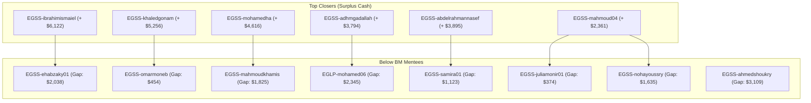

# 🚀 BIG TEAM 01 — PERFORMANCE ACCELERATION PLAN & DAILY TRACKERS
### **Operational Roadmap: Day 26 to Day 30 (Sep 26 – Sep 30, 2026)**
**Sector Cash:** **$152,109 / $225,600 (67.4%)** | **Gap to Sector BM (68%):** **$1,299** | **Days Left:** **4**
**Active Reps at BM:** **13 of 25 (52.0%)** | **Reps Below BM:** **12 of 25 (48.0%)**

---

## 🎯 OBJECTIVE & EXECUTIVE ALIGNMENT
With the sector now standing at **$152,109 (67.4%)**, we are just **$1,299 away from the entire sector achieving official BM benchmark (68%)**. Furthermore, **13 representatives have already achieved BM**. 

This operational plan mobilizes our strongest performers to support the remaining 12 representatives, capitalizing on the **Kuwait, UAE, and Qatar payday weekend** (Sep 25–28) to maximize cash and close all gaps before Month-End.

---

## 📌 ACTION POINT 1: Prioritize & Convert All High-Potential Opportunities

### Data-Driven Lead Segmentation (4,599 Active Students Extracted)
All students who completed **>1 class this month** have been extracted and ranked per representative into:
`D:\Lens\Dashboard\leads\high_potential\`

Each lead is scored using the **Propensity-to-Renew Index**:
$$\text{Priority Score} = (\text{Completed Classes} \times 2) - \text{Booked Unattended Classes}$$

### Priority Tiers for Outbound Calls:
1. **Tier A (Score $\ge 20$, Classes $\ge 10$ + M2 Upgrade / Unfixed Teacher):**
   - *Status:* Highly active, loyal, love the product.
   - *Script:* "Celebrating student progress + offering VIP Payday Renewal Package with free bonus lessons."
   - *Expected Close Rate:* **45% – 55%**.
2. **Tier B (Score $8–18$, Classes $4–9$):**
   - *Status:* Regular attenders, mid-frequency.
   - *Script:* "Class momentum + teacher lock-in guarantee for the next term."
   - *Expected Close Rate:* **25% – 35%**.
3. **Tier C (Classes $2–3$):**
   - *Status:* Need encouragement, attendance re-activation.
   - *Script:* "Overcoming scheduling friction + special renewal concession."
   - *Expected Close Rate:* **15% – 20%**.

---

## 📌 ACTION POINT 2: Structured Lead Follow-Up Matrix

Every contacted parent **must have an unambiguous next step and timestamped SLA**. No lead may be left in "Pending" without an active disposition.

| Lead Status | Customer Response | Mandatory Next Step | SLA | Responsible |
|---|---|---|---|---|
| **Hot Interested** | Agreed in principle; awaiting salary/transfer | Send personalized payment link on WhatsApp; set calendar reminder | Within 15 min | Assigned Rep |
| **Objection: Price** | Wants discount / installments | Escalate to Team Leader for paired closing call with package concession | Within 2 hours | 2nd-Call Supporter |
| **Objection: Teacher** | Wants to keep or change current tutor | Offer Teacher Fixation guarantee (Unfixed Binding Lead conversion) | Immediate | Assigned Rep |
| **Follow-up: Payday** | Explicitly requested: "Call me after salary is deposited" | Mark for Payday Blast (Kuwait today, UAE/Qatar tomorrow 11:00 AM) | Scheduled | Assigned Rep |
| **No Answer (R1-R3)** | Unanswered call | Send standardized WhatsApp Voice Note + Class Milestone card | Within 30 min | Assigned Rep |

---

## 📌 ACTION POINT 3: Support-Pairing Structure for 2nd Calls & Closing

We have **13 above-BM champions** with surplus performance who will act as **2nd-Call Closers** for the 12 below-BM colleagues.



### Operational Pairing Roster:

| Supporter (Above BM) | Surplus | Assigned Mentee (Below BM) | BM Gap | Targeted Action |
|---|---:|---|---:|---|
| **EGSS-mahmoud04** (90.7%) | +$2,361 | **EGSS-juliamonir01** | **$374** | ⚡ **1 small renewal closes BM today!** Joint call on top 5 M2 leads. |
| **EGSS-khaledgonam** (118.7%) | +$5,256 | **EGSS-omarmoneb** | **$454** | ⚡ **1 renewal closes BM today!** Khaled co-calls on 16 unfixed leads. |
| **EGSS-abdelrahmannasef** (108.1%) | +$3,895 | **EGSS-samira01** | **$1,123** | Abdelrahman assists with closing scripts on 77 students with 12+ classes. |
| **EGSS-mahmoud04** (90.7%) | +$2,361 | **EGSS-nohayoussry** | **$1,635** | Co-calling session targeting Noha's **47 M2 upgrade pool**. |
| **EGSS-mohamedha** (117.6%) | +$4,616 | **EGSS-mahmoudkhamis** | **$1,825** | Mohamedha takes 2nd call on Khamis's 41 M2 students. |
| **EGSS-ibrahimismaiel** (128.2%) | +$6,122 | **EGSS-ehabzaky01** | **$2,038** | TL Ibrahim leads live 3-way conference calls on high-ticket renewals. |
| **EGSS-adhmgadallah** (112.7%) | +$3,794 | **EGLP-mohamed06** | **$2,345** | Adhm assists TL Mohamed06 to convert 23 unfixed teacher students. |
| **EGSS-amrsafwat** (86.6%) | +$2,277 | **EGSS-ahmedshoukry** | **$3,109** | Quality filtering from Ahmed's 81 heavy users (12+ classes). |
| **EGSS-mohamedha** (117.6%) | +$4,616 | **EGLP-shahdmahmoud** | **$3,418** | TL direct intervention on top 10 students. |
| **EGSS-ibrahimismaiel** (128.2%) | +$6,122 | **EGLP-saraht** | **$3,971** | Mentorship and co-closing on active renewals. |
| **EGSS-ashraqatal** (TL) | N/A | **EGLP-yasmin01** | **$3,794** | Account reallocation or direct closing support. |

---

## 📌 ACTION POINT 4: Targeted Intensive Intervention for High-Gap Agents

Agents with a gap $> \$2,000$ to BM require **daily morning war-room sessions** and structured account reviews:

### High-Gap Recovery Protocol:
1. **Daily Lead Audit (10:00 – 10:30 AM):**
   - TL audits the rep's top 15 highest-class students.
   - Verify every lead has phone + WhatsApp verified.
2. **Mandatory 3-Way Calls (2nd Calls):**
   - Rep makes initial discovery call (5 min).
   - If parent expresses hesitation, rep brings in the designated 2nd-Call Closer:
     *"Mr. Ahmed, I have our Senior Academic Manager on the line who can authorize the Payday Teacher Lock-in package for you today..."*
3. **Daily Minimum Contact Rate:**
   - 35 effective dials/day.
   - Minimum 15 WhatsApp interactions with payment links/proposals.

---

## 📌 ACTION POINT 5: Daily Checkpoints & Mid-Day Corrective Action

To prevent EOD surprises, teams operate on a strict **4-Stage Daily Cadence**:

| Checkpoint | Time | Focus | Corrective Trigger |
|---|---|---|---|
| **Checkpoint 1** | **11:00 AM** | Attendance, lead allocation & target declaration | Rep has <15 prioritized leads ready $\rightarrow$ TL reallocates leads |
| **Checkpoint 2** | **14:00 PM** | Mid-Day Progress Review | 0 contracts closed & 0 payment links out $\rightarrow$ Mandatory pairing session |
| **Checkpoint 3** | **17:30 PM** | Peak Gulf Calling Window Kickoff | Check payments pending in bank/links $\rightarrow$ Active phone follow-up |
| **Checkpoint 4** | **21:00 PM** | Pre-EOD Push & Reconciliation | Uncollected payments $\rightarrow$ Send urgent Payday reservation notice |

---

## 📌 ACTION POINT 6: Gulf Payday Maximization Strategy (Kuwait, UAE, Qatar)

The period between the **24th and 28th of every month** accounts for **>60% of monthly sales conversion**. We are currently in the peak of this window!

### Market-Specific Payday Playbook:

```
┌─────────────────────────────────────────────────────────────────────────────┐
│                       GULF PAYDAY CONVERSION MATRIX                         │
├─────────────────┬─────────────────┬────────────────────┬────────────────────┤
│ Country         │ Salary Timing   │ Peak Buying Hours  │ High-Impact Pitch  │
├─────────────────┼─────────────────┼────────────────────┼────────────────────┤
│ 🇰🇼 Kuwait      │ Sep 24 – 26     │ 12:00 – 15:00      │ "Payday Bonus:     │
│                 │ (TODAY: Peak!)  │ 18:00 – 22:00      │ Extra lessons +    │
│                 │                 │                    │ Teacher Lock"      │
├─────────────────┼─────────────────┼────────────────────┼────────────────────┤
│ 🇦🇪 UAE         │ Sep 26 – 28     │ 17:00 – 22:00      │ "Term Continuity + │
│                 │ (Starting NOW)  │                    │ Sibling Package"   │
├─────────────────┼─────────────────┼────────────────────┼────────────────────┤
│ 🇶🇦 Qatar       │ Sep 25 – 27     │ 16:00 – 21:00      │ "VIP Native Teacher│
│                 │ (Active NOW)    │                    │ Priority Slot"     │
└─────────────────┴─────────────────┴────────────────────┴────────────────────┘
```

### High-Converting Payday WhatsApp Script:
> *"عزيزي ولي أمر الطالب [اسم الطالب]، تحياتنا من أسرة 51Talk 🌟 بمناسبة إيداع الرواتب ونهاية الشهر، تم اعتماد عرض تجديد خاص وحصري بحسابكم يتضمن [عدد حصص إضافية مجانية] مع ضمان تثبيت المعلم المفضل [اسم المعلم] للفترة القادمة. هذا العرض ساري حتى نهاية عطلة نهاية الأسبوع فقط. هل نفعّل لكم الرابط للاستفادة من البونص؟"*

---

## 📌 ACTION POINT 7: Standardized EOD Review & Tracking Template

Every Team Leader must submit this standardized report in the management group at **22:00 Daily**:

### 📋 Team Leader EOD Report Format:
```markdown
📢 [ME-EGSSXX] End-of-Day Performance & Pipeline Report
📅 Date: Sep 26, 2026 | Day 26 / 30

1. Financial Results:
   - Daily Cash Closed Today: $ [Amount]
   - Total Net Cash Month-to-Date: $ [Amount] / $ [Target] ([Ach] %)
   - Total Contracts Closed Today: [X] Orders (MTD: [Y])

2. BM Status & Closings Today:
   - Reps who achieved BM today: [Names]
   - Total Team Reps at BM: [X] / [Total]

3. Support-Pairing Execution:
   - Total 2nd calls conducted today: [Count]
   - Successful 2nd-call closings: [Count] ($ Value: $[Amount])

4. Remaining Gap & Immediate Pipeline for Tomorrow:
   - Reps still below BM & their exact gaps: [Rep: $Gap]
   - Active payment links awaiting payment tomorrow morning: [Count] ($ Value: $[Amount])
   - Kuwait/UAE/Qatar Payday target students scheduled for tomorrow: [Count]
```

---

## 🏆 EXPECTED SECTOR RESULTS BY TOMORROW (DAY 27)

With **Juliamonir01** ($374 gap) and **Omarmoneb** ($454 gap) positioned for immediate same-day closings, the sector will reach:
- **15 Reps at BM (60.0%)**
- **Sector Cash: $\ge \$155,000$ (Surpassing the 68% BM Pace)**
- **Team ME-EGSS30 reaching 100% BM across all members.**
