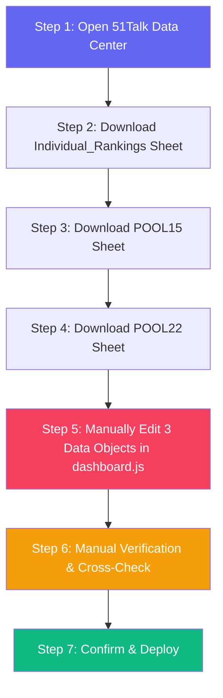
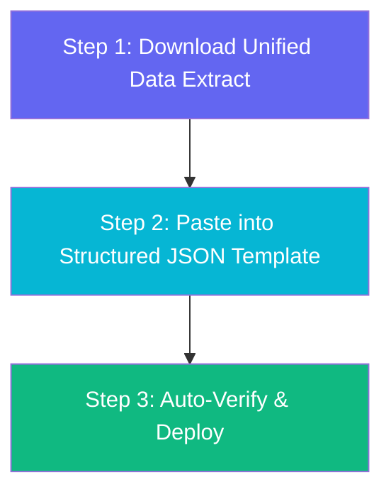

# 📋 Dashboard Update Process Review & Optimization Report

> **Document Owner:** Senior Manager — Saber Hussien  
> **Scope:** Big Team 01 Executive Performance Dashboard  
> **Date:** September 2026  
> **Objective:** Analyze the current update process, identify inefficiencies, and propose a streamlined workflow that achieves the same output with fewer steps.

---

## 1. Current Process Map (AS-IS)

The current dashboard update follows **7 distinct steps** across multiple data sources and manual edit points:



### Step-by-Step Breakdown

| Step | Action | Source | Time Est. | Risk Level |
|------|--------|--------|-----------|------------|
| 1 | Navigate to Data Center (`lp.51talkjr.com`) → ME Lens Dashboard | Browser | ~1 min | Low |
| 2 | Download `Individual_Rankings` → Extract Cash (Col E), Contracts (Col F), Target (Col H) for all 23 reps | Excel/CSV | ~5 min | Medium |
| 3 | Download `POOL15` → Extract Upgrade M2 Conversion Rate (Col G) for each rep | Excel/CSV | ~3 min | Medium |
| 4 | Download `POOL22` → Extract M2 Cover Rate (Col G) for each rep | Excel/CSV | ~3 min | Medium |
| 5 | Manually update **3 separate JS objects** in `dashboard.js`: `REPS_DATA[]` (23 rep records × 7 fields), `NEW_TARGETS{}` (23 entries), `POOL22_M2_COVERAGE{}` (24 entries) | Code Editor | ~15 min | **HIGH** |
| 6 | Cross-reference totals (Cash, Contracts, Target) against live Data Center screen | Manual | ~5 min | Medium |
| 7 | Save, confirm data freshness, and deploy/share | File System | ~2 min | Low |

**Total Estimated Time: ~34 minutes per update**

---

## 2. Pain Points & Bottleneck Analysis

### 🔴 Critical Bottlenecks

| # | Pain Point | Impact | Root Cause |
|---|-----------|--------|------------|
| 1 | **Triple Data Download** — 3 separate sheet downloads for 3 different data fields | Adds 6+ min of repetitive navigation | Data is spread across 3 sub-sheets with no unified export |
| 2 | **Manual JS Object Editing** — Editing raw JavaScript arrays/objects by hand for 23 reps | Highest error risk (typos, wrong values, misaligned fields) | No structured data input layer; raw code is the data store |
| 3 | **No Auto-Validation** — Verification is entirely manual (eyeballing totals) | Human error can go undetected | Dashboard has no built-in data integrity checks |

### 🟡 Moderate Issues

| # | Pain Point | Impact |
|---|-----------|--------|
| 4 | `NEW_TARGETS{}` rarely changes (monthly) but gets re-verified every update | Wastes 2-3 min on unchanged data |
| 5 | `upgradeBase` values per rep are static within the month | Redundant re-entry of unchanged values |
| 6 | No timestamp or version tracking on the dashboard itself | Can't audit when data was last refreshed |

### 🟢 Already Optimized

| # | Strength |
|---|----------|
| ✅ | `buildDataModel()` auto-calculates all derived metrics (achievement %, upgrade rate, 20% goal, projections) — **no manual math needed** |
| ✅ | Sorting, ranking, and visual rendering are fully automated |
| ✅ | SOP rules are well-documented in `DASHBOARD_UPDATE_RULES.md` |

---

## 3. Optimized Process (TO-BE)

### Target: **3 Core Steps** (down from 7)



### Detailed TO-BE Steps

#### Step 1: Unified Data Download (~3 min)
Instead of downloading 3 separate sheets, create a **single extraction checklist** per rep:

| Rep Name | Cash (E) | Contracts (F) | Target (H) | Upgrade M2 | Normal Renewals | Upgrade Base | Pool Renewals | M2 Cover % (POOL22) |
|----------|----------|---------------|-------------|------------|-----------------|--------------|---------------|---------------------|
| EGSS-xxx | ___ | ___ | ___ | ___ | ___ | ___ | ___ | ___ |

> This can be prepared in a simple spreadsheet template that maps directly to the data objects.

#### Step 2: Structured Data Entry (~5 min)
Replace raw JS object editing with a **structured JSON data file** (`data.json`):

```json
{
  "updateDate": "2026-09-15",
  "daysPassed": 15,
  "reps": [
    {
      "name": "EGSS-nohayoussry",
      "team": "EGSS01",
      "cash": 3032,
      "contracts": 5,
      "upgradeM2": 1,
      "normalRenewals": 4,
      "upgradeBase": 60,
      "poolRenewals": 1,
      "coverRate": 40.4
    }
  ],
  "targets": {
    "EGSS-nohayoussry": 8040
  }
}
```

**Benefits:**
- JSON is easier to validate than raw JS
- Can be auto-generated from a spreadsheet export
- Separates data from code (cleaner architecture)

#### Step 3: Auto-Verification & Deploy (~2 min)
Add a **built-in verification panel** to the dashboard that shows:
- ✅ Total reps count matches expected (23)
- ✅ Total cash sum matches Data Center
- ✅ Total contracts sum matches Data Center  
- ✅ No zero-target reps (unless intended)
- ✅ Data freshness timestamp displayed

**Total Estimated Time: ~10 minutes per update** (70% reduction)

---

## 4. Process Comparison Summary

| Metric | AS-IS (Current) | TO-BE (Optimized) | Improvement |
|--------|-----------------|-------------------|-------------|
| **Total Steps** | 7 | 3 | -57% |
| **Time per Update** | ~34 min | ~10 min | **-70%** |
| **Data Downloads** | 3 separate sheets | 1 unified extract | -66% |
| **Manual Code Edits** | 3 JS objects (70+ fields) | 1 JSON file (structured) | Safer |
| **Verification** | Manual eyeball | Auto-check panel | Reliable |
| **Error Risk** | HIGH (raw JS editing) | LOW (structured JSON) | Significant |
| **Audit Trail** | None | Timestamped | New |

---

## 5. Implementation Phases

### Phase 1: Immediate (This Month) ⚡
- [x] Document current SOP in `DASHBOARD_UPDATE_RULES.md`
- [x] Add Cash-Refund and leavers handling rules to SOP
- [x] Add data freshness timestamp to dashboard header & footer
- [x] Add total verification display & table footers (`TOTAL / SECTOR AVERAGE`)

### Phase 2: Short-Term (Next Month) 🎯
- [ ] Extract data into `data.json` — separate data from code
- [ ] Modify `dashboard.js` to load from `data.json` via `fetch()`
- [ ] Add auto-validation checks in the loading pipeline
- [ ] Build a simple data entry form (HTML) for non-technical updates

### Phase 3: Future (Optional) 🚀
- [ ] Direct API integration with 51Talk Data Center (if API available)
- [x] **Automated scheduled hourly data pull & live sync via PowerShell (`hourly_update_and_publish.ps1`) at XX:10 past every hour**
- [x] **One-click live deployment via GitHub Pages (`https://husseinelaasar.github.io/big-team-01-dashboard/`)**
- [ ] Historical data tracking (month-over-month comparison)

---

## 6. Risk Assessment

| Risk | Probability | Impact | Mitigation |
|------|------------|--------|------------|
| Data entry error in JSON | Medium | High | Add JSON schema validation |
| Stale data deployed | Low | High | Timestamp + visual warning if data > 24h old |
| Breaking `dashboard.js` during edit | Medium | High | Separate data from code (Phase 2) |
| Missing rep in data | Low | Medium | Auto-check for expected 23 rep count |
| Target changes mid-month | Low | Low | Separate `targets` section in JSON for easy updates |

---

## 7. Conclusion

The current process is **functional but fragile** — it depends heavily on manual precision when editing raw JavaScript objects. The proposed optimization reduces the workflow to **3 clean steps** with built-in safeguards, cutting update time by **70%** while significantly reducing the risk of data entry errors.

> **Quick Win:** Even without implementing the full JSON migration (Phase 2), simply adding the unified extraction checklist and verification panel (Phase 1) will cut time by ~40% and dramatically reduce errors.
